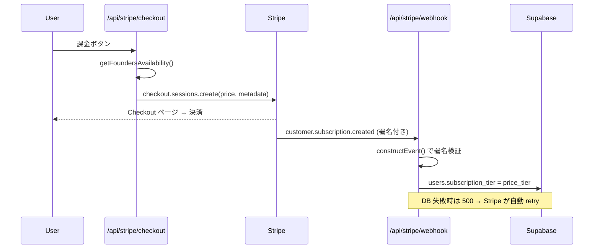

> ※ 公開時は `repos/zenn/articles/<slug>.md` へ slug 規約に沿って配置する。本ファイルは ALTER リポ内の下書き。

## 起点 — なぜ「永久 lock-in 価格」を選んだのか

1 年と数ヶ月前、自分は迫さん（@sako_brain）の「ゲーム×副業×フィットネスを AI で」というポスト（ https://x.com/sako_brain/status/2054790607076499585 ）を起点に、ALTER という個人開発 SaaS を作りました。

個人開発で一番こわいのは、最初に応援してくれた人を、後から来た人と同じ条件にしてしまうことです。そこで「最初の 50 人だけ、永久に半額」という Founders 価格を用意しました。一度 ¥500/月 で入れば、枠が埋まって通常価格が ¥980/月 になっても、その人はずっと ¥500 のまま。

この記事は、その価格設計を Stripe + Next.js でどう実装したかの記録です。残枠カウンター、Checkout の価格出し分け、Webhook での tier 自動遷移までを、コードを開示しながら書きます。

## 要件 — 「永久半額・50 枠・完売後は通常価格」

仕様を 4 行に落とすとこうです。

1. Founders は ¥500/月、**先着 50 枠**まで
2. 50 枠が埋まったら、新規は通常 Pro ¥980/月 のみ
3. **既に Founders で入っている人の価格は、完売後も上がらない**（＝永久 lock-in）
4. 解約したら free に戻す

ポイントは 3 番です。「永久」をどう実装するか。答えは拍子抜けするほど単純で、**Stripe の subscription は契約時の price に紐づき、こちらが何もしなければ価格は変わらない**。だから「既存を据え置く」ために特別なことをするのではなく、**新規にだけ別 price を割り当てる**だけで lock-in が成立します。難しいのは「いま何枠空いているか」を安全に出し分ける側です。

## 残枠カウンター — 「同時購入」をどう捌くか

残枠は、課金中（pro または founders）かつ未削除のユーザー数を数えて、50 から引くだけの純関数です。

```typescript
// lib/stripe/founders-availability.ts （抜粋）
export const FOUNDERS_CAP = 50;

export async function getFoundersAvailability(
  supabase: SupabaseClient<Database>,
): Promise<FoundersAvailability> {
  const { count, error } = await supabase
    .from('users')
    .select('id', { count: 'exact', head: true })
    .in('subscription_tier', ['pro', 'founders'])
    .is('deleted_at', null);
  if (error) {
    // 数えられない時は「募集中」に倒す（販売を止めない fail-open）
    return { current: 0, remaining: FOUNDERS_CAP, available: true };
  }
  const current = count ?? 0;
  const remaining = Math.max(0, FOUNDERS_CAP - current);
  return { current, remaining, available: remaining > 0 };
}
```

ここで正直に書いておきます。**このカウンターはソフトキャップです。** 数えているのは `users.subscription_tier` ですが、この列が `founders` になるのは決済後の Webhook 処理が終わってから。つまり「残り 1 枠」の瞬間に 2 人が同時に Checkout を始めると、両方とも `available: true` を見て、51 人目が生まれ得ます。

β50 という規模では、数枠のオーバーランは実害より「応援者が増えた」メリットの方が大きいと判断し、ソフトキャップのまま運用しています。厳密にゼロ overshoot にしたいなら、Checkout 直前に予約レコードを `INSERT ... WHERE count < 50` 相当でアトミックに取る設計にしますが、個人開発の初速ではオーバーエンジニアリングと割り切りました。`available` がエラー時に `true` へ倒れる（fail-open）のも同じ思想で、「販売を止めない」を優先しています。

## Checkout — 残枠で price を出し分け、metadata に tier を刻む

価格の選択は Checkout Session を作る瞬間に決めます。残枠があれば Founders price、なければ Pro price。

```typescript
// app/api/stripe/checkout/route.ts （抜粋）
const availability = await getFoundersAvailability(supabase);
const useFounders = !isAnnual && availability.available;
const priceId = isAnnual
  ? stripeReady.priceIdProAnnual!
  : useFounders
    ? stripeReady.priceIdFounders! // ¥500 永久
    : stripeReady.priceIdPro!; // ¥980
const priceTier = useFounders ? 'founders' : 'pro';

const session = await stripe.checkout.sessions.create({
  mode: 'subscription',
  customer: customerId,
  line_items: [{ price: priceId, quantity: 1 }],
  subscription_data: {
    metadata: { supabase_user_id: user.id, price_tier: priceTier },
    // 月額初回のみ 14 日トライアル（再登録での trial 連打は started_at で防ぐ）
    ...(!isAnnual && !profile?.subscription_started_at
      ? { trial_period_days: 14 }
      : {}),
  },
  locale: 'ja',
});
```

肝は `subscription_data.metadata` に **`supabase_user_id` と `price_tier` を刻む**ことです。Stripe の世界には自分のアプリのユーザー ID は存在しないので、ここで結びつけておかないと、後の Webhook で「誰の・どの tier の課金か」が分かりません。price ID 自体は env から注入し（`priceIdFounders` 等）、コードにもリポにも実値は置きません。

なお、既に Pro / Founders のユーザーが再度 Checkout を叩いた場合は 409 で弾き、Customer Portal に誘導します。二重課金を防ぐ最初の関所です。

## Webhook — 署名検証して tier を自動遷移

決済の確定は、フロントの success_url ではなく **Stripe Webhook を信頼の源**にします。success_url はユーザーが閉じれば届かないし、改ざんもできるからです。



Webhook は必ず署名検証から入ります。**raw body のまま** `constructEvent` に渡すのが要点で、JSON パース後の body だと署名が合いません。

```typescript
// app/api/stripe/webhook/route.ts （抜粋）
const sig = request.headers.get('stripe-signature');
const rawBody = await request.text(); // ← パース前の生body
let event: Stripe.Event;
try {
  event = stripe.webhooks.constructEvent(rawBody, sig, env.STRIPE_WEBHOOK_SECRET);
} catch {
  return new NextResponse('Invalid signature', { status: 400 });
}

switch (event.type) {
  case 'customer.subscription.created': {
    const sub = event.data.object as Stripe.Subscription;
    const userId = sub.metadata?.supabase_user_id ?? null;
    const priceTier = (sub.metadata?.price_tier as 'founders' | 'pro') ?? 'pro';
    if (!userId) break;
    const { error } = await admin
      .from('users')
      .update({ subscription_tier: priceTier, subscription_started_at: /* sub.created */ })
      .eq('id', userId);
    if (error) return new NextResponse('DB update failed', { status: 500 }); // ← Stripe が retry
    break;
  }
  case 'customer.subscription.deleted':
    // tier を 'free' に戻す
    break;
}
```

Checkout で刻んだ `price_tier` を、ここでそのまま `users.subscription_tier` に書きます。`founders` で契約した人は `founders` のまま記録されるので、完売後に通常価格へ切り替わっても、この人のレコードも Stripe の subscription も触られません。これが lock-in の実体です。

DB 更新に失敗したら **500 を返す**のも意図的です。Stripe は 2xx 以外を受け取ると指数バックオフで自動 retry してくれるので、一時的な DB 障害やマイグレーション適用前の取りこぼしも、後から復活します。Webhook を「落としても Stripe が覚えていてくれる」前提で組むと、堅牢になります。

## 据え置きと解約 — 冪等に倒す

完売後の据え置きは、前述のとおり「何もしない」が答えです。既存の Founders subscription に対してこちらから price 変更 API を呼ばない限り、Stripe は ¥500 を請求し続けます。

解約は `customer.subscription.deleted` を受けて tier を `free` に戻すだけ。退会導線は Stripe Customer Portal に寄せていて、自前で解約 UI を作っていません（カード変更・解約・領収書を Stripe 側に任せ、実装と責任を減らす）。

リファラル報酬の付与は `invoice.paid`（実課金 amount_paid > 0）で発火しますが、付与済みフラグで冪等にしているため、2 回目以降の請求サイクルで再発火しても二重付与しません。Webhook は「同じイベントが複数回届く」前提で、**全ハンドラを冪等に**しておくのが事故を防ぐコツです。

## 試してみたい方へ

「最初に応援してくれた人を、ずっと優遇する」は、技術的にはこれだけで作れます。Stripe の price に subscription が紐づく性質を、そのまま lock-in として使うだけです。

ALTER は、副業とダイエットを 1 つのキャラで育てる「焦らせない」観察 RPG です。いまその Founders 50 枠（¥500/月・永久ロックイン）を開放しています。

→ ALTER: https://alter.ponfreelance.com

アーキテクチャ全体や職業判定ロジックは Qiita に別記事として書いています。

---

**著者**：ぽん（@pon_freelance）
