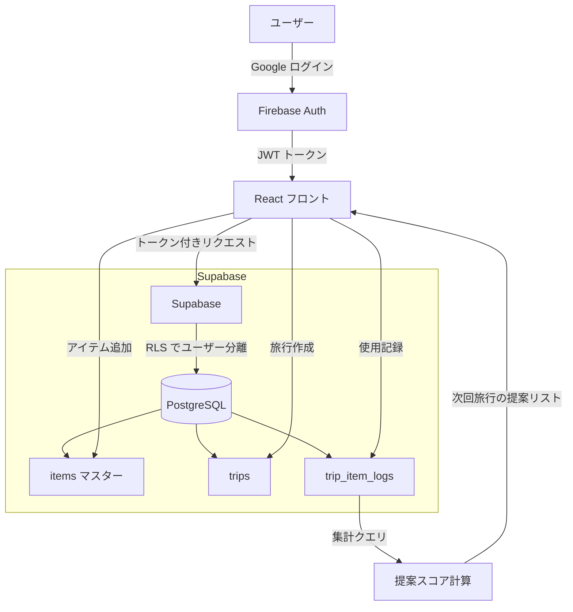

旅行のたびに「あれ持ってくれば良かった」を繰り返していた。スプレッドシートで管理しようとしたが、旅行の種類や季節によって必要なものが変わるので汎用リストはすぐ破綻する。そこで「過去の旅行経験を蓄積して、次回の旅行に自動的に最適化されたリストを提案する」アプリを React / TypeScript / Supabase / Chakra UI / Firebase で個人開発した。この記事では、そのデータ設計とUI設計の判断理由を書く。

## 前提

### 解きたい問題

旅行の持ち物管理ツールは世の中にたくさんある。自分が既存ツールに満足できなかった理由は2つだ。

1. **リストが「静的」すぎる** — 「海外旅行用」「国内旅行用」のような固定テンプレートは、旅行先・季節・旅行スタイルの組み合わせに対応できない
2. **「持っていったが使わなかった」が記録されない** — 次回の旅行で同じ荷物を持っていく判断材料がない

解決したかったのは「自分の旅行パターンに合わせて、リストが勝手に賢くなっていく」という体験だ。

### 技術スタック

- フロントエンド: React / TypeScript / Chakra UI
- バックエンド/DB: Supabase（PostgreSQL + Auth + Storage）
- 認証: Firebase Authentication
- ホスティング: Vercel

Supabase と Firebase を併用している理由は後述する。

### 制約

- 個人開発なのでインフラコストはできる限りゼロに近づけたい
- 自分が毎日使うツールなので、UX の妥協は避けたい
- 将来的に「AI による持ち物提案」を追加したいので、データ構造は拡張性を持たせる

## 設計案の比較

### データモデル: 持ち物の「経験」をどう持つか

旅行の持ち物管理で一番設計が難しいのは「経験の蓄積」をどのテーブル構造で表現するか、だ。3つの案を比較した。

#### 案A: 旅行ごとにリストをコピーする（フラット構造）

```
trips
  └─ items (旅行ごとに全アイテムをコピー)
```

旅行を作るたびに全アイテムをコピーして、そこに `used / not_used` フラグを付ける。シンプルで実装が速い。

**問題点**: 「このアイテムを過去5回の旅行でどう使ったか」を集計するには、全旅行のアイテムをスキャンしないといけない。アイテム名の表記ゆれ（「充電器」「充電ケーブル」「USB充電器」）が発生したとき、名寄せが困難になる。

#### 案B: マスターアイテムテーブルを持つ（正規化構造）

```
items (マスター)
  └─ trip_items (旅行×アイテムの中間テーブル)
       └─ trips
```

アイテムをマスター管理して、旅行との関係は中間テーブルで持つ。集計クエリが書きやすく、名寄せも容易。

**問題点**: アイテムが「誰の」マスターなのかをユーザー単位で管理する必要があり、マルチユーザー対応時にスキーマが複雑になる。また「このアイテムはこの旅行でどう使ったか」という文脈情報（メモ、数量）を中間テーブルに持たせると、中間テーブルが肥大化する。

#### 案C: 経験ログとして分離する（イベントソース的構造）

```
items (マスター: カテゴリ・タグ付き)
  └─ trip_item_logs (旅行ごとの使用記録: used/not_used/forgot)
trips (旅行メタデータ: 行き先・期間・季節・旅行タイプ)
```

アイテムのマスターと、旅行ごとの「使用ログ」を分離する。ログには `used / not_used / forgot` の3状態を持たせる。「持っていったが使わなかった」と「持っていくのを忘れた」を区別できるのが案Aとの決定的な違いだ。

**採用した理由**: 「次回の旅行でこのアイテムを提案すべきか」の判定ロジックが書きやすい。`used` 率と `forgot` 率の組み合わせで提案スコアを計算できる。将来的にAI提案を追加するときも、このログテーブルをそのまま学習データとして使える。

**トレードオフ**: 案Bと比べてテーブル数が増えるので、初期実装のコストは高い。ただし「経験から学ぶ」という要件に正直に向き合うなら、ログを分離するのが正しいと判断した。

### 認証: Supabase Auth vs Firebase Authentication

Supabase には Auth 機能が内蔵されているので、Firebase を使わなくてもいい。それでも Firebase を使った理由がある。

| 評価軸 | Supabase Auth | Firebase Auth |
|---|---|---|
| Google ログイン | ○ | ◎（設定が簡単） |
| Apple ログイン | △（要設定） | ◎ |
| 匿名ログイン | ○ | ◎ |
| SDK の使いやすさ | △ | ◎ |
| 無料枠 | ○ | ◎ |

Supabase Auth の Google ログイン設定は、OAuth の redirect URI の扱いが Firebase より複雑で、ローカル開発環境での動作確認に手間がかかった。Firebase Auth はすでに別プロジェクトで使い慣れていたこともあり、認証だけ Firebase に任せて、データは Supabase で管理するという役割分担にした。

デメリットは「認証トークンを Supabase に渡すブリッジ処理が必要になる」こと。Firebase の JWT を Supabase の RLS（Row Level Security）と連携させるための設定が一手間かかる。それでも「確実に動く認証」を優先した。

## 採用した設計

### データフロー全体像



### テーブル設計

```sql
-- 旅行マスター
create table trips (
  id uuid primary key default gen_random_uuid(),
  user_id text not null,          -- Firebase UID
  title text not null,
  destination text,
  start_date date,
  end_date date,
  trip_type text,                  -- 'business' | 'leisure' | 'outdoor'
  season text,                     -- 'spring' | 'summer' | 'autumn' | 'winter'
  created_at timestamptz default now()
);

-- アイテムマスター（ユーザーごと）
create table items (
  id uuid primary key default gen_random_uuid(),
  user_id text not null,
  name text not null,
  category text,                   -- '衣類' | '電子機器' | '衛生用品' ...
  tags text[],                     -- ['海外', '冬', 'アウトドア'] など
  created_at timestamptz default now()
);

-- 旅行×アイテムの使用ログ
create table trip_item_logs (
  id uuid primary key default gen_random_uuid(),
  trip_id uuid references trips(id) on delete cascade,
  item_id uuid references items(id) on delete cascade,
  status text not null,            -- 'used' | 'not_used' | 'forgot'
  quantity int default 1,
  memo text,
  created_at timestamptz default now()
);
```

`tags` を配列型で持たせているのは、アイテムが複数のコンテキストに属せるようにするためだ。「モバイルバッテリー」は「電子機器」カテゴリに属しながら、`['海外', '長距離移動']` というタグを持つ。このタグを旅行の `trip_type` や `season` と突き合わせることで、提案スコアを計算する。

### 提案スコアの計算ロジック

```typescript
type ItemLog = {
  item_id: string;
  status: 'used' | 'not_used' | 'forgot';
};

type SuggestedItem = {
  item_id: string;
  name: string;
  score: number; // 0.0 ~ 1.0
  reason: string;
};

function calcSuggestionScore(
  logs: ItemLog[],
  currentTripType: string,
  currentSeason: string,
  itemTags: string[]
): number {
  const total = logs.length;
  if (total === 0) return 0.5; // 初回は中立スコア

  const usedCount = logs.filter(l => l.status === 'used').length;
  const forgotCount = logs.filter(l => l.status === 'forgot').length;

  // 使用率 + 忘れた率（忘れたということは必要だった）
  const baseScore = (usedCount + forgotCount * 0.8) / total;

  // タグが現在の旅行コンテキストにマッチするかでブースト
  const contextMatch = itemTags.includes(currentTripType) ||
                       itemTags.includes(currentSeason);
  const contextBoost = contextMatch ? 0.1 : 0;

  return Math.min(baseScore + contextBoost, 1.0);
}
```

`forgot`（忘れた）を `used` の 0.8 倍のスコアとして扱うのがポイントだ。「忘れたが必要だった」は「持っていって使った」とほぼ同等の情報価値がある。`not_used`（持っていったが使わなかった）はスコアに貢献しない。

## 実装上の罠

### Supabase RLS と Firebase JWT の連携

Supabase の Row Level Security（RLS）はデフォルトで Supabase Auth の `auth.uid()` を使う。Firebase Auth の JWT を使う場合、Supabase の JWT 検証設定を変更する必要がある。

具体的には Supabase の `JWT Secret` を Firebase の公開鍵と合わせる必要があるが、Firebase は公開鍵をローテーションするので、静的に設定することができない。

自分が採用した回避策は「Supabase の `service_role` キーを使ったサーバーサイド操作」と「クライアントサイドでは Firebase UID を `user_id` カラムに直接格納して RLS で比較する」方式の組み合わせだ。

```sql
-- RLS ポリシー（Firebase UID を直接比較）
create policy "ユーザー自身のデータのみ参照可"
  on trips for select
  using (user_id = current_setting('request.jwt.claims', true)::json->>'sub');
```

Firebase JWT の `sub` クレームにユーザー UID が入っているので、それを `user_id` と比較する。この設定を見つけるまでに Supabase のドキュメントを3時間読んだ。

### Chakra UI v3 の破壊的変更

開発途中で Chakra UI を v2 から v3 にアップグレードしたところ、`useColorMode` の挙動が変わっていた。v2 では `localStorage` にカラーモードを保存していたが、v3 ではデフォルトで `system` 設定に追従するようになっていて、手動で設定したカラーモードが再起動時にリセットされる問題が発生した。

```typescript
// v3 での対応: ColorModeProvider に initialColorMode を明示する
<ChakraProvider theme={theme}>
  <ColorModeProvider
    options={{ initialColorMode: 'light', useSystemColorMode: false }}
  >
    <App />
  </ColorModeProvider>
</ChakraProvider>
```

バージョンアップのタイミングで破壊的変更を確認しなかった自分のミスだが、マイナーバージョンアップに見せかけてメジャーレベルの変更が入っていたので注意が必要だ。

### `tags` 配列の検索パフォーマンス

PostgreSQL の配列型に対して `@>` 演算子（含む）で検索するとき、インデックスが効かないケースがある。

```sql
-- インデックスなしだと全件スキャンになる
select * from items where tags @> array['海外'];
```

GIN インデックスを張ることで解決した。

```sql
create index items_tags_gin on items using gin(tags);
```

データ量が少ないうちは気にならないが、アイテム数が増えてきたときに検索が遅くなることに気づいた。最初からインデックスを設計に含めておくべきだった。

## 振り返り

### 「経験の蓄積」設計は正しかったか

結論から言うと、正しかった。3回の旅行を経験した時点で「このアイテムは毎回使っている」「これは一度も使っていない」という事実が可視化されるようになり、次の旅行の荷造りが明らかに速くなった。

ただ、スコア計算のロジックはまだ荒削りだ。旅行の長さ（1泊 vs 2週間）や旅行先の気候を加味していないので、同じアイテムでも「3泊の国内旅行」と「10日の海外旅行」で重み付けが変わらない。ここは今後改善したい。

### 技術選定の反省

Supabase と Firebase の併用は「動くが複雑」な選択だった。認証だけ Firebase に任せた理由は「使い慣れているから」という惰性の部分が大きい。今から設計し直すなら Supabase Auth に統一して複雑さを排除する。個人開発では「使い慣れている」より「シンプルに保つ」を優先すべきだと改めて思った。

Chakra UI は UI コンポーネントの品質が高く、ダークモード対応やアクセシビリティが最初から整っているのは個人開発には助かる。ただしバージョン間の破壊的変更には注意が必要で、アップグレードは CHANGELOG を必ず読んでから行うようにした。

### 「自分が使うツール」を作ることの強さ

個人開発で一番モチベーションが続くのは、自分が毎日使うものを作ることだと実感している。旅行のたびにアプリを開いて、帰ってきたらログを付ける。このサイクルが自然に回るようになったとき、「データが育っている」という感覚があって、それが開発を続ける動力になっている。

「経験から学ぶ」という設計思想は、アプリ自体がユーザーと一緒に成長するという体験を生む。静的なテンプレートアプリとの一番大きな違いはそこだと思っている。

---

## 関連リンク

[AutoTrader 実装学習キット (FastAPI × React Native)](https://autotrader-lp.onrender.com/)

by ぽん ([@pon_freelance](https://x.com/pon_freelance))
