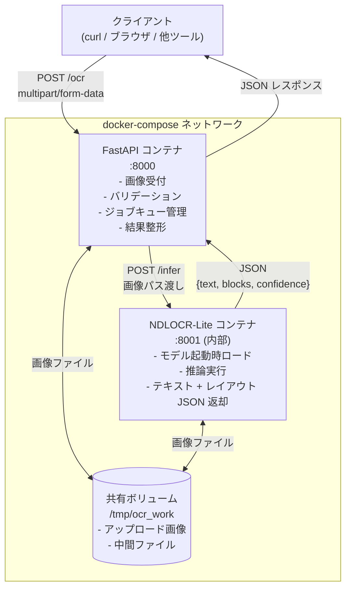

国会図書館が公開している OCR エンジン「NDLOCR-Lite」を、FastAPI で包んでローカル Web サービスとして動かした。制約は「GPU なし・個人の Mac 一台・外部 API 課金ゼロ」。既製の OCR SaaS を使えば済む話だが、古文書や縦書き和文の認識精度が商用サービスより高いケースがあり、自前でサービス化する価値があると判断した。この記事では、その設計判断の理由を中心に書く。

## 前提

### NDLOCR-Lite とは

国立国会図書館が開発・公開している OCR ライブラリ。元々は大規模な NDLOCR（GPU 必須）の軽量版で、CPU 環境でも動作する。日本語の縦書き・横書き混在レイアウト、ルビ、旧字体への対応が特徴だ。

ライセンスは BSD-4-Clause で商用利用可能。ただし「公開されているのはライブラリであって、API サーバーではない」という点が今回の出発点になる。

### 解きたい問題

手元に古い書籍の PDF や画像が大量にある。これを全文検索可能なテキストに変換したい。要件を整理するとこうなった。

- 縦書き和文の認識精度を優先する
- 処理は手元のマシンで完結させる（スキャンデータを外部に送りたくない）
- 複数の画像をまとめて投げて、結果を JSON で受け取りたい
- 将来的に他のツールから HTTP でたたけるようにしたい

「CLI を直接叩けばいい」という選択肢もある。ただし複数ファイルのバッチ処理、進捗確認、他ツールとの連携を考えると、HTTP インターフェースを一枚かぶせる価値があると判断した。

### 環境

- MacBook Pro（Apple Silicon、GPU なし扱い）
- Docker Desktop
- Python 3.11
- FastAPI 0.111
- NDLOCR-Lite（pip インストール可能版）

## 設計案の比較

### 案 A: CLI ラッパーをそのまま subprocess で呼ぶ

FastAPI のエンドポイントから `subprocess.run` で NDLOCR-Lite の CLI を呼び出す。

```
[FastAPI] --subprocess--> [ndlocr CLI] --> stdout --> [JSON レスポンス]
```

**メリット**: 実装が速い。CLI が提供するオプションをそのまま使える。

**デメリット**: subprocess の起動コストが 1 リクエストごとにかかる。NDLOCR-Lite は初期化時にモデルをロードするので、毎回 3〜5 秒の待機が発生する。並列リクエストへの対応も難しい。

### 案 B: Python ライブラリとして直接インポートする（プロセス内呼び出し）

FastAPI のプロセス内で NDLOCR-Lite を import して、モデルを起動時に一度だけロードする。

```
[FastAPI 起動時] --> [モデルロード（1回だけ）]
[リクエスト] --> [ロード済みモデルで推論] --> [JSON レスポンス]
```

**メリット**: モデルロードのコストが起動時の 1 回だけ。レスポンスが速い。

**デメリット**: NDLOCR-Lite の依存ライブラリ（OpenCV、PyTorch 等）が FastAPI の実行環境に入る。依存関係の衝突リスクが高く、環境が壊れたときの原因特定が難しい。

### 案 C: Docker でプロセスを完全分離する（採用）

NDLOCR-Lite とその依存関係を Docker イメージに閉じ込め、FastAPI は別コンテナで動かす。コンテナ間通信で推論を呼び出す。

```
[FastAPI コンテナ] --HTTP--> [NDLOCR-Lite コンテナ]
```

**メリット**: 依存関係が完全に分離される。NDLOCR-Lite 側の環境を壊しても FastAPI 側に影響しない。将来的に推論コンテナだけスケールアウトできる。

**デメリット**: コンテナ間通信のオーバーヘッドが増える。docker-compose の設定が必要で、初期構築コストが案 A・B より高い。

**案 B と案 C を比較して案 C を選んだ理由**: NDLOCR-Lite の依存ライブラリのバージョン要件が厳しく、FastAPI まわりの他ライブラリと衝突するケースが検証中に発生した。「動く環境を再現可能な状態で固定する」ことを優先すると、Docker による分離が最も安全だ。コンテナ間通信のレイテンシは画像の OCR 処理時間（数秒〜十数秒）に対して誤差の範囲なので、デメリットは許容できると判断した。

## 採用した設計

### 全体アーキテクチャ



画像データ自体はコンテナ間で HTTP ボディに乗せて転送するのではなく、**共有ボリューム経由でパスだけを渡す**設計にした。理由は 2 つある。

1. 大きな画像ファイル（数 MB〜十数 MB）を HTTP ボディで転送するとメモリ消費が跳ね上がる
2. NDLOCR-Lite はファイルパスを受け取って処理する設計なので、パスを渡す方が自然

### FastAPI 側のエンドポイント設計

エンドポイントは 3 つに絞った。

```
POST /ocr          - 画像を受け取って OCR ジョブを登録、job_id を返す
GET  /ocr/{job_id} - ジョブの状態と結果を返す
POST /ocr/sync     - 同期処理（小さい画像向け、結果を直接返す）
```

最初は `/ocr` 一本で「受け取って処理して返す」同期設計にしていた。ところが A4 スキャン画像 1 枚の処理に 15〜30 秒かかるケースがあり、HTTP タイムアウトに引っかかった。

非同期ジョブ設計に切り替えた。ジョブの状態管理は Redis や DB を使わず、**プロセス内の dict** で持つ割り切りにした。

```python
# jobs.py
import asyncio
from dataclasses import dataclass, field
from enum import Enum
from typing import Any

class JobStatus(str, Enum):
    PENDING = "pending"
    RUNNING = "running"
    DONE = "done"
    FAILED = "failed"

@dataclass
class OcrJob:
    job_id: str
    status: JobStatus = JobStatus.PENDING
    result: Any = None
    error: str | None = None
    created_at: float = field(default_factory=lambda: asyncio.get_event_loop().time())

_jobs: dict[str, OcrJob] = {}

def register(job_id: str) -> OcrJob:
    job = OcrJob(job_id=job_id)
    _jobs[job_id] = job
    return job

def get(job_id: str) -> OcrJob | None:
    return _jobs.get(job_id)
```

Redis を使わなかった理由は「個人の Mac で動かすサービスにインフラを増やしたくない」という制約からだ。プロセスが再起動するとジョブが消えるが、OCR は冪等な処理なので再投入すれば済む。このトレードオフは用途を考えると許容範囲だと判断した。

### NDLOCR-Lite コンテナ側の設計

NDLOCR-Lite コンテナは FastAPI（Uvicorn）で薄く包んだ内部 API として動かす。

```python
# ocr_worker/main.py
from fastapi import FastAPI
from ndlocr_lite import NDLOCRLite  # 仮のインポートパス
from contextlib import asynccontextmanager

ocr_engine = None

@asynccontextmanager
async def lifespan(app: FastAPI):
    global ocr_engine
    # 起動時に一度だけモデルをロード
    ocr_engine = NDLOCRLite()
    ocr_engine.load_models()
    yield
    ocr_engine = None

app = FastAPI(lifespan=lifespan)

@app.post("/infer")
async def infer(payload: InferRequest):
    if ocr_engine is None:
        raise HTTPException(status_code=503, detail="model not ready")
    result = ocr_engine.run(payload.image_path)
    return {"text": result.text, "blocks": result.blocks}
```

`lifespan` でモデルロードを起動時に一度だけ実行する設計は、過去の AutoTrader 開発で FastAPI のライフサイクル管理を経験していたのでそのまま流用した。「ポートバインドを先に完了させてからモデルをロードする」順序は、ヘルスチェックのタイムアウトを避けるために重要だ。

### docker-compose の構成

```yaml
# docker-compose.yml（抜粋）
services:
  api:
    build: ./api
    ports:
      - "8000:8000"
    volumes:
      - ocr_work:/tmp/ocr_work
    environment:
      - OCR_WORKER_URL=http://ocr_worker:8001
    depends_on:
      ocr_worker:
        condition: service_healthy

  ocr_worker:
    build: ./ocr_worker
    expose:
      - "8001"
    volumes:
      - ocr_work:/tmp/ocr_work
    healthcheck:
      test: ["CMD", "curl", "-f", "http://localhost:8001/health"]
      interval: 10s
      timeout: 5s
      retries: 10
      start_period: 60s  # モデルロードに時間がかかるので長めに設定

volumes:
  ocr_work:
```

`start_period: 60s` を設定したのは、NDLOCR-Lite のモデルロードが CPU 環境では 30〜50 秒かかるためだ。ここを短くすると `api` コンテナが起動時に `ocr_worker` を unhealthy と判定して落ちる。

## 実装上の罠

### 罠 1: 画像の向きが自動補正されない

スキャン画像が 90 度回転して保存されていることがある。NDLOCR-Lite はそのまま処理するので、縦書きの本が横向きに認識されて精度が激落ちする。

Pillow で EXIF の Orientation タグを読んで事前補正するミドルウェアを挟んだ。

```python
from PIL import Image, ExifTags

def fix_orientation(image_path: str) -> str:
    img = Image.open(image_path)
    exif = img._getexif()
    if exif is None:
        return image_path
    
    orientation_key = next(
        k for k, v in ExifTags.TAGS.items() if v == "Orientation"
    )
    orientation = exif.get(orientation_key, 1)
    
    rotation_map = {3: 180, 6: 270, 8: 90}
    if orientation in rotation_map:
        img = img.rotate(rotation_map[orientation], expand=True)
        img.save(image_path)
    
    return image_path
```

スキャナーの機種によって EXIF が埋め込まれていないケースもある。その場合は諦めてそのまま投げる。

### 罠 2: Apple Silicon での PyTorch の挙動

NDLOCR-Lite は内部で PyTorch を使う。Apple Silicon の Mac で Docker を動かすとき、`platform: linux/arm64` と `linux/amd64` でイメージの挙動が変わる。

`linux/amd64` を Rosetta 2 エミュレーションで動かすと、PyTorch の CPU 推論が極端に遅くなる（arm64 ネイティブの 3〜5 倍遅い）。`linux/arm64` のイメージを使うのが正解だが、NDLOCR-Lite の依存ライブラリの arm64 対応状況を確認する必要がある。

```dockerfile
# ocr_worker/Dockerfile
FROM --platform=linux/arm64 python:3.11-slim
```

`--platform` を明示しないと Docker Desktop が自動判定するが、ライブラリのバイナリ互換で詰まることがある。

### 罠 3: 同時リクエストでモデルがクラッシュする

NDLOCR-Lite のモデルはスレッドセーフでないケースがある。FastAPI は async で動くが、推論処理は同期的な CPU バウンド処理なので `asyncio.Lock` で直列化した。

```python
import asyncio

_infer_lock = asyncio.Lock()

@app.post("/infer")
async def infer(payload: InferRequest):
    async with _infer_lock:
        # 推論は同時に1つだけ実行する
        result = await asyncio.to_thread(
            ocr_engine.run, payload.image_path
        )
    return result
```

`asyncio.to_thread` で同期処理をスレッドプールに投げつつ、Lock で直列化する。スループットは下がるが、クラッシュよりはマシだ。個人用途なら並列度より安定性を優先する。

これは AutoTrader で取引所 API の同時アクセスを防ぐために使った `asyncio.Lock` と同じパターンで、「同時に 1 つだけ実行する」という制約を Lock で表現するのは汎用的な解だと改めて感じた。

### 罠 4: 共有ボリュームのファイルが溜まり続ける

`/tmp/ocr_work` に保存した画像ファイルを明示的に削除しないと、ディスクが溢れる。ジョブ完了後にクリーンアップする処理を入れた。

```python
import os
from pathlib import Path

async def cleanup_job_files(job_id: str):
    work_dir = Path(f"/tmp/ocr_work/{job_id}")
    if work_dir.exists():
        for f in work_dir.iterdir():
            f.unlink()
        work_dir.rmdir()
```

ジョブ完了から 1 時間後に削除するタイマーを `asyncio.create_task` で仕込んでいる。APScheduler を入れるほどでもないので、`asyncio.sleep` で十分だ。

## 振り返り

### 設計判断の振り返り

Docker による分離は正解だった。NDLOCR-Lite の依存ライブラリのバージョンを固定できるので、「先週まで動いていたのに今日動かない」という状況を防げる。個人開発でも再現性は重要だ。

プロセス内 dict でジョブ管理する割り切りも、個人用途なら正しかった。Redis を追加してインフラを複雑にするより、「プロセス再起動で消えるが再投入すれば済む」という制約を受け入れた方がメンテナンスコストが低い。

反省点は `/ocr/sync` の同期エンドポイントを最初から設計に含めていなかったこと。「小さい画像は同期で返してほしい」という用途は明らかに存在するのに、非同期ジョブ設計に切り替えた後で後付けした。最初から両方のインターフェースを設計しておくべきだった。

### NDLOCR-Lite の認識精度について

縦書き和

---

## 関連リンク

[AutoTrader 実装学習キット (FastAPI × React Native)](https://autotrader-lp.onrender.com/)

by ぽん ([@pon_freelance](https://x.com/pon_freelance))
