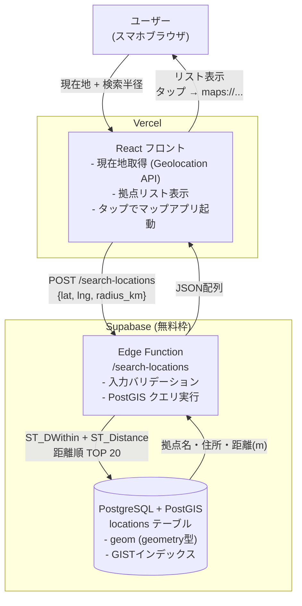

古いスマホやモバイルバッテリーが引き出しに溜まっていた。捨てようとして初めて気づいたのが「リチウムイオン電池はどこに持っていけばいいのか、調べるのが面倒すぎる」という問題だ。自治体のサイト、家電量販店のWebページ、JBRCの回収拠点マップ——情報が散在していて、現在地から一番近い拠点を一発で出してくれるものがなかった。ならば自分で作ろう、というのが出発点だ。制約は「無料枠で動かす・自分一人が使う・地理検索を自前で実装しない」の3つ。

## 前提

### 解きたい問題

「今いる場所から一番近いリチウムイオン電池の回収拠点はどこか」を、アプリを開いて10秒以内に答えてくれる画面が欲しかった。それだけだ。

既存の選択肢を試した結果、こうなった。

- **JBRCの公式マップ**: 拠点数は多いが、現在地からの距離順ソートがない。地図をスクロールして目視で探す必要がある
- **自治体のWebページ**: 拠点情報がPDFや表形式で、住所をコピーしてマップアプリに貼る手間がある
- **Googleマップで検索**: 「リチウムイオン電池 回収」で検索しても、回収拠点でない店舗が混じる

「現在地 → 近い順に拠点リスト表示 → タップでナビ起動」という3ステップを実現するアプリが欲しかった。

### 技術スタック

- フロントエンド: React / TypeScript / Tailwind CSS
- バックエンド/DB: Supabase（PostgreSQL + PostGIS + Edge Functions）
- ホスティング: Vercel
- 拠点データ: JBRCの公開データをスクレイピング＋手動補完

### 制約

- 個人用なのでインフラコストはゼロ（Supabaseの無料枠、Vercelの無料枠）
- 地理的な近傍検索（現在地から半径Xkm以内の拠点を距離順に返す）が必要
- 拠点データは自分でメンテするので、更新フローをシンプルに保ちたい

## 設計案の比較

### 地理検索をどこで実装するか

「現在地から近い順に拠点を返す」というクエリをどこで処理するかが、最初の設計判断だった。3つの案を比較した。

#### 案A: フロントエンドで全件取得してJavaScriptで距離計算

全拠点データをAPIから取得して、ブラウザ側でHaversine公式を使って距離計算し、ソートする。

**メリット**: バックエンドに特別な機能が不要。Supabaseの無料枠でも普通のテーブルとして管理できる。

**デメリット**: 拠点数が増えると初期ロードが重くなる。JBRCの登録拠点は全国で数万件規模なので、全件転送は現実的でない。また、フロントエンドで緯度経度を持つ全拠点データを返すAPIを公開することになり、データの使われ方を制御しにくい。

#### 案B: バックエンドでBounding Boxフィルタ＋アプリ側で距離計算

現在地の緯度経度から「±0.1度の矩形範囲」に絞り込むSQLをバックエンドで実行し、その結果をフロントで距離ソートする。

```sql
SELECT * FROM locations
WHERE lat BETWEEN :lat - 0.1 AND :lat + 0.1
  AND lng BETWEEN :lng - 0.1 AND :lng + 0.1;
```

**メリット**: 案Aより転送データ量を減らせる。実装がシンプル。

**デメリット**: Bounding Boxは矩形なので、角の方向にある拠点が「距離は近いのに除外される」ケースがある。また、0.1度という閾値が緯度によって実距離に差が出る（赤道付近と高緯度では1度あたりの距離が異なる）。

#### 案C: PostGISで地理的近傍検索（採用）

SupabaseはPostgreSQLベースなので、PostGIS拡張を有効化すれば`ST_DWithin`や`ST_Distance`が使える。

```sql
SELECT
  id,
  name,
  address,
  ST_Distance(
    geom::geography,
    ST_SetSRID(ST_MakePoint(:lng, :lat), 4326)::geography
  ) AS distance_meters
FROM locations
WHERE ST_DWithin(
  geom::geography,
  ST_SetSRID(ST_MakePoint(:lng, :lat), 4326)::geography,
  :radius_meters
)
ORDER BY distance_meters
LIMIT 20;
```

**メリット**: 距離計算が球面上の正確な計算になる。インデックス（GISTインデックス）が効くので、拠点数が増えてもクエリが遅くならない。「半径Xkm以内」という自然な指定ができる。

**デメリット**: PostGISの有効化とgeometryカラムの設定が必要で、初期構築コストが案A・Bより高い。SupabaseのダッシュボードからSQL Editorで拡張を有効化する手順を踏む必要がある。

**案Bと案Cを比較して案Cを選んだ理由**: Bounding Boxフィルタは「とりあえず動く」が、「半径3km以内の拠点を近い順に」という要件に正直に向き合うと、球面距離計算が必要になる。Supabaseは無料枠でもPostGISが使えると確認できたので、最初から正しい道具を使う判断をした。初期コストは高いが、後からBounding Boxを球面距離に置き換えるリファクタリングコストの方が高くつくと判断した。

### 拠点データの管理: スクレイピング自動化 vs 手動メンテ

JBRCの公開データを定期的に自動取得するか、初回だけ取得して手動で補完するかを比較した。

| 評価軸 | 自動スクレイピング | 手動メンテ |
|---|---|---|
| データの鮮度 | ◎ | △ |
| 実装コスト | △（スクレイピング + スケジューラー） | ◎ |
| 運用コスト | △（スクレイピング壊れたとき対応） | ○ |
| 個人用途への適合 | △（オーバースペック） | ◎ |

自分一人が使うツールで、拠点の追加・廃止は月に数件程度だ。自動スクレイピングのインフラを組むより、「気づいたときにSupabaseのダッシュボードから直接編集する」運用の方がトータルコストが低いと判断した。

## 採用した設計

### 全体アーキテクチャ



### テーブル設計

```sql
-- PostGIS 拡張の有効化（Supabase SQL Editor で一度だけ実行）
create extension if not exists postgis;

-- 拠点テーブル
create table locations (
  id          uuid primary key default gen_random_uuid(),
  name        text not null,           -- 拠点名（例: "ヤマダ電機 渋谷店"）
  address     text not null,           -- 住所（表示用）
  category    text,                    -- 'home_appliance' | 'convenience' | 'municipality'
  geom        geometry(Point, 4326),   -- 緯度経度（WGS84）
  source_url  text,                    -- データ出典URL
  verified_at date,                    -- 手動確認日
  created_at  timestamptz default now()
);

-- GISTインデックス（ST_DWithin が使うインデックス）
create index locations_geom_gist on locations using gist(geom);
```

`geom` カラムに `geometry(Point, 4326)` を使う。SRID 4326 は GPS が返す緯度経度と同じ座標系（WGS84）なので、ブラウザの `Geolocation API` が返す値をそのまま使える。

データ投入時は `ST_SetSRID(ST_MakePoint(lng, lat), 4326)` で変換する。緯度と経度の順序が `(lat, lng)` ではなく `(lng, lat)` であることに注意が必要だ（PostGISは `(x, y)` = `(経度, 緯度)` の順）。

### Edge Function の実装

```typescript
// supabase/functions/search-locations/index.ts
import { createClient } from "https://esm.sh/@supabase/supabase-js@2";

interface SearchRequest {
  lat: number;
  lng: number;
  radius_km: number;
}

Deno.serve(async (req) => {
  const { lat, lng, radius_km }: SearchRequest = await req.json();

  // 入力バリデーション
  if (
    lat < 20 || lat > 46 ||   // 日本の緯度範囲
    lng < 122 || lng > 154 || // 日本の経度範囲
    radius_km <= 0 || radius_km > 50
  ) {
    return new Response(
      JSON.stringify({ error: "invalid parameters" }),
      { status: 400 }
    );
  }

  const supabase = createClient(
    Deno.env.get("SUPABASE_URL")!,
    Deno.env.get("SUPABASE_SERVICE_ROLE_KEY")!
  );

  const { data, error } = await supabase.rpc("search_nearby_locations", {
    user_lat: lat,
    user_lng: lng,
    radius_meters: radius_km * 1000,
    result_limit: 20,
  });

  if (error) {
    return new Response(JSON.stringify({ error: error.message }), { status: 500 });
  }

  return new Response(JSON.stringify(data), {
    headers: { "Content-Type": "application/json" },
  });
});
```

PostGISのクエリはEdge Function内に直接書かずに、**PostgreSQLのRPC関数**として切り出した。

```sql
-- Supabase SQL Editor で作成する RPC 関数
create or replace function search_nearby_locations(
  user_lat float,
  user_lng float,
  radius_meters float,
  result_limit int default 20
)
returns table (
  id uuid,
  name text,
  address text,
  category text,
  distance_meters float
)
language sql
stable
as $$
  select
    id,
    name,
    address,
    category,
    ST_Distance(
      geom::geography,
      ST_SetSRID(ST_MakePoint(user_lng, user_lat), 4326)::geography
    ) as distance_meters
  from locations
  where ST_DWithin(
    geom::geography,
    ST_SetSRID(ST_MakePoint(user_lng, user_lat), 4326)::geography,
    radius_meters
  )
  order by distance_meters
  limit result_limit;
$$;
```

クエリをRPC関数に分離した理由は2つある。

1. Edge FunctionはTypeScript（Deno）で動くので、SQL文字列を直接組み立てるとSQLインジェクションのリスクがある。RPCに切り出してパラメータを型付きで渡す方が安全だ
2. クエリのチューニングをSupabaseのSQL Editorで直接試せる。Edge Functionを再デプロイせずにクエリだけ変更できる

### フロントエンドの現在地取得

```typescript
// hooks/useCurrentLocation.ts
import { useState, useEffect } from "react";

type LocationState =
  | { status: "idle" }
  | { status: "loading" }
  | { status: "success"; lat: number; lng: number }
  | { status: "error"; message: string };

export function useCurrentLocation() {
  const [location, setLocation] = useState<LocationState>({ status: "idle" });

  const fetch = () => {
    if (!navigator.geolocation) {
      setLocation({ status: "error", message: "Geolocation非対応のブラウザです" });
      return;
    }
    setLocation({ status: "loading" });
    navigator.geolocation.getCurrentPosition(
      (pos) => {
        setLocation({
          status: "success",
          lat: pos.coords.latitude,
          lng: pos.coords.longitude,
        });
      },
      (err) => {
        const messages: Record<number, string> = {
          1: "位置情報の許可が必要です",
          2: "位置情報を取得できませんでした",
          3: "位置情報の取得がタイムアウトしました",
        };
        setLocation({
          status: "error",
          message: messages[err.code] ?? "不明なエラー",
        });
      },
      { timeout: 10000, maximumAge: 60000 }
    );
  };

  return { location, fetch };
}
```

`maximumAge: 60000` を設定しているのは、1分以内にキャッシュされた位置情報があればそれを使うためだ。毎回GPSを取得し直すと電池消費が増える。回収拠点を探すユースケースでは1分前の位置情報で十分だ。

### マップアプリ起動のURL設計

拠点をタップしたとき、ネイティブのマップアプリでナビを起動したい。iOSとAndroidで対応するURL schemeが異なる。

```typescript
function buildNavigationUrl(address: string): string {
  const encoded = encodeURIComponent(address);
  // iOS: Apple Maps、Android: Google Maps にフォールバック
  const isIOS = /iPad|iPhone|iPod/.test(navigator.userAgent);
  if (isIOS) {
    return `maps://?q=${encoded}`;
  }
  return `https://www.google.com/maps/search/?api=1&query=${encoded}`;
}
```

住所文字列をそのまま渡す設計にした。緯度経度を渡す方が正確だが、住所の方が「目的地の名前」としてマップアプリに表示されて視認性がいい。どちらが正しいかはユースケース次第で、今回は「目的地を確認しながらナビを起動する」体験を優先した。

## 実装上の罠

### 罠1: PostGISの`geography`型と`geometry`型の使い分け

`ST_Distance`には`geometry`型と`geography`型の2つのオーバーロードがある。

- `geometry`型: 平面座標での距離計算。単位はSRIDによって異なる（4326なら度）
- `geography`型: 球面上の距離計算。単位はメートル

最初に`geometry`型のまま`ST_Distance`を使ったところ、返ってくる値が「度」単位になっていた。`0.01`という数値が返ってきて「10メートル？」と思ったら「約1.1km」だった。

`::geography`でキャストすることでメートル単位の球面距離が返るようになる。`ST_DWithin`も同様に`::geography`キャストが必要だ。このキャストを忘れると`radius_meters: 3000`（3km）を渡しても「3度以内」という全然違う範囲になる。

### 罠2: Geolocation APIはHTTPSでないと動かない

ローカル開発中に`http://localhost:3000`で動かしていたところ

---

## 関連リンク

[AutoTrader 実装学習キット (FastAPI × React Native)](https://autotrader-lp.onrender.com/)

by ぽん ([@pon_freelance](https://x.com/pon_freelance))
