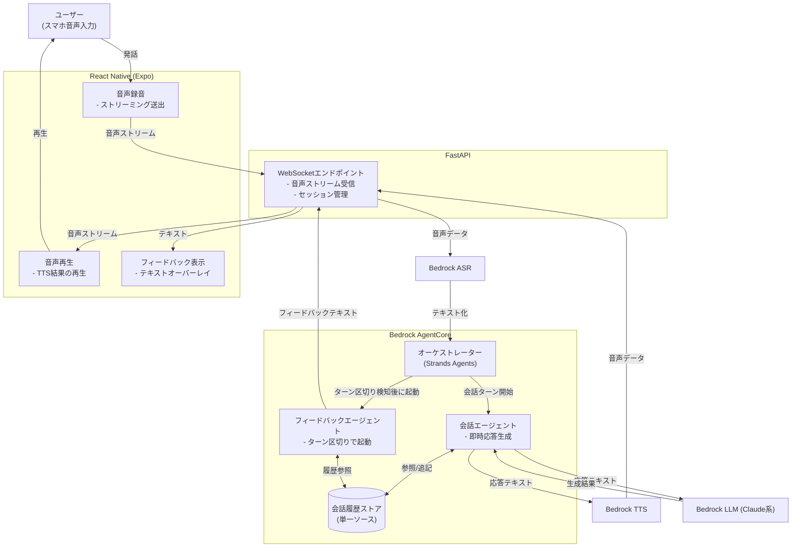

```markdown
---
title: "AIと英会話できる学習アプリを個人開発した設計判断 — Agentcore / Strands / Bedrock で音声対話をどう組んだか"
emoji: "🤖"
type: "tech"
topics: ["python", "fastapi", "bedrock", "個人開発"]
published: false
---

英語学習アプリを個人開発でリリースした。既存の英会話アプリに感じていた不満は「決まったスクリプトをなぞるだけで、雑談的な広がりがない」こと。AWS の Bedrock AgentCore と Strands Agents を使い、音声で自由に話しかけられるAIチューターを FastAPI × React Native Expo で構築した。制約は「個人開発の運用コストを抑える」「レイテンシを会話が成立するレベルに収める」の2つ。この記事ではエージェント構成とバックエンドの設計判断を中心に書く。

## 前提

### 解きたい問題

英会話アプリを何本か試した結果、不満点は3つに集約された。

1. **会話が台本通り** — フリートークのつもりで話しかけても、想定外の返答をすると強引にシナリオへ引き戻される
2. **文脈を保持しない** — 前の発言を踏まえた深掘りができず、毎回ゼロから会話が始まる感覚になる
3. **フィードバックが後回し** — 発音や文法の指摘が会話終了後にまとめて出るだけで、会話中の自然な訂正がない

やりたかったのは「講師と雑談しながら、必要な場面で軽くフィードバックが入る」体験だ。これを実現するには、単純なプロンプト1発のLLM呼び出しではなく、会話の状態管理・音声入出力・フィードバック生成を分業させるエージェント構成が必要だと判断した。

### 技術スタック

- フロントエンド: React Native (Expo) / TypeScript
- バックエンド: FastAPI
- エージェント基盤: Amazon Bedrock AgentCore
- エージェントフレームワーク: Strands Agents
- LLM: Bedrock 経由の Claude 系モデル
- 音声認識/合成: Bedrock 経由のASR/TTS（会話部分のみ）

### 制約

- 個人開発なので、常時起動のGPUサーバーやセルフホスト型ASR基盤は持ちたくない
- 会話のレイテンシは「発話 → 応答開始」まで2〜3秒程度に抑えたい
- Expo でクロスプラットフォーム対応しつつ、音声のストリーミング処理を破綻させたくない

## 設計案の比較

### エージェント構成をどう分割するか

英会話の「雑談」と「フィードバック」を1つのプロンプトにまとめるか、役割ごとに分けるかで3案を比較した。

#### 案A: 単一プロンプトで会話とフィードバックを同時生成

1回のLLM呼び出しで「英語の返答」と「日本語での訂正コメント」を同時に出力させる。

**メリット**: 実装がシンプル。呼び出し回数が1回で済むのでレイテンシが低い。

**デメリット**: プロンプトが肥大化し、返答の一貫性が崩れやすい。特に「会話のテンポを保つ」ことと「文法を細かく指摘する」ことは目的が競合しやすく、出力形式が安定しない場面が検証中に多発した。

#### 案B: 会話エージェントとフィードバックエージェントを完全に別プロセスで並列実行

会話生成とフィードバック生成を別々のエージェントに分離し、非同期で並列に呼び出す。

```
[ユーザー発話]
   ├─→ [会話エージェント] → 即座に音声応答
   └─→ [フィードバックエージェント] → 後追いでテキスト表示
```

**メリット**: 会話のレイテンシがフィードバック生成の重さに引きずられない。それぞれのプロンプトを役割特化させられるので出力が安定する。

**デメリット**: 2エージェントの状態（会話履歴）を同期させる必要があり、状態管理が複雑になる。フィードバック側が会話の文脈を見失うと、的外れな指摘が出る。

#### 案C: Strands Agents のマルチエージェント構成でオーケストレーターを挟む（採用）

会話エージェントとフィードバックエージェントを分離しつつ、両者が同じ会話履歴ストアを参照する構成にした上で、オーケストレーターが呼び出し順序とタイミングを制御する。

**メリット**: 案Bの「状態がズレる」問題を、単一の会話履歴ソースに統一することで解消できる。オーケストレーターがフィードバック生成を「会話のターンが一区切りついたタイミング」でのみ起動するよう制御できるため、無駄な呼び出しも減る。

**デメリット**: オーケストレーター自体の設計・デバッグコストが増える。エージェント間のメッセージパッシングをどう設計するかで初期の試行錯誤が長引いた。

**案Bと案Cを比較して案Cを選んだ理由**: 案Bは実装が速いが、「会話履歴の二重管理」という技術的負債を最初から抱え込む設計だった。会話が長くなるほど2つのエージェントの認識がズレていく問題は、後から直すと手戻りが大きい。オーケストレーターの初期コストを払ってでも、履歴を単一ソースに保つ方が長期的に安定すると判断した。

### 音声処理: クライアント側でASR/TTSを持つか、サーバー側に寄せるか

| 評価軸 | クライアント側処理 | サーバー側(Bedrock経由)処理 |
|---|---|---|
| レイテンシ | ○（ネットワーク往復が減る） | △（Bedrock呼び出し分増える） |
| 実装の一貫性 | △（iOS/Android差異対応） | ◎（1箇所に集約） |
| 運用コスト | ◎（サーバー負荷なし） | △（呼び出し課金が発生） |
| フィードバック連携 | △（音声データをサーバーに送り直す手間） | ◎（会話エージェントと同じ基盤で完結） |

クライアント側でASR/TTSを完結させると、フィードバックエージェントが発音の細かい情報（音素レベルのズレなど）を扱えなくなる。個人開発で2プラットフォーム分のネイティブ音声APIの差異を吸収するコストも避けたかったため、音声処理はサーバー側、具体的にはBedrock経由のASR/TTSに寄せる設計にした。レイテンシは多少犠牲になるが、会話エージェントとフィードバックエージェントが同じ音声認識結果を参照できる一貫性を優先した。

## 採用した設計

### 全体アーキテクチャ



音声はWebSocketでストリーミングし、会話エージェントの応答が返り次第すぐ再生を始める設計にした。フィードバックエージェントは会話のブロッキング要因にせず、非同期でUIに追記表示する形にしている。

### セッション状態の持ち方

会話履歴はAgentCore側の履歴ストアを単一ソースとし、FastAPI側では「どのセッションIDがどのWebSocket接続に紐づいているか」だけを管理する。

```python
# session_manager.py
from dataclasses import dataclass, field
from starlette.websockets import WebSocket

@dataclass
class ConversationSession:
    session_id: str
    websocket: WebSocket
    turn_count: int = 0
    is_feedback_pending: bool = False

_sessions: dict[str, ConversationSession] = {}

def register(session_id: str, ws: WebSocket) -> ConversationSession:
    session = ConversationSession(session_id=session_id, websocket=ws)
    _sessions[session_id] = session
    return session

def get(session_id: str) -> ConversationSession | None:
    return _sessions.get(session_id)
```

会話の中身をFastAPI側に持たせない理由は、AgentCore側の履歴ストアとFastAPI側のメモリで会話状態が二重管理になるのを避けるためだ。FastAPIはあくまで「音声の中継とセッションの生存管理」に徹し、会話ロジックはAgentCore/Strandsの領域に閉じ込めた。

### ターン区切りの検知ロジック

フィードバックエージェントをいつ起動するかは、無音区間の長さと発話の完結性で判定している。

```python
SILENCE_THRESHOLD_MS = 800

def is_turn_complete(silence_duration_ms: int, transcript: str) -> bool:
    if silence_duration_ms < SILENCE_THRESHOLD_MS:
        return False
    # 文の途中で切れていそうな場合はターン継続とみなす
    if transcript.rstrip().endswith((",", "and", "but", "so")):
        return False
    return True
```

`800ms` という閾値は、実際に自分で会話しながら調整した値だ。短すぎると考え中の間を発話終了と誤判定し、長すぎるとテンポが悪くなる。この手の閾値はドキュメントに正解がなく、実機で試すしかなかった。

## 実装上の罠

### AgentCoreのコールドスタート

Bedrock AgentCore はリクエストが一定時間なければリソースが縮退し、次回呼び出し時にコールドスタートが発生する。個人開発で常時トラフィックがあるわけではないため、最初の発話だけ応答が3〜4秒遅れる問題が頻発した。

対策として、アプリ起動時（会話画面を開いた瞬間）に軽量なウォームアップリクエストを1回投げる設計にした。

```python
async def warmup_agent(session_id: str):
    # 実際の会話には使わない、極小のダミー呼び出し
    await invoke_agent(session_id, prompt="ping", max_tokens=1)
```

ユーザーが最初の発話をするまでの数秒間にウォームアップが完了していれば、体感の遅延はほぼ消える。完全な解決ではないが、個人開発の運用コストを増やさずに対応できる範囲での妥協点だった。

### WebSocket切断時のクリーンアップ漏れ

Expo アプリをバックグラウンドに回すとWebSocket接続がOS側で強制切断されることがあるが、FastAPI側の切断検知が遅れ、セッション情報が残り続ける問題が発生した。

```python
@app.websocket("/ws/conversation")
async def conversation_ws(websocket: WebSocket):
    await websocket.accept()
    session_id = str(uuid4())
    session_manager.register(session_id, websocket)
    try:
        while True:
            data = await websocket.receive_bytes()
            await handle_audio_chunk(session_id, data)
    except WebSocketDisconnect:
        session_manager.remove(session_id)
    finally:
        # try/exceptだけだと接続の異常終了を取りこぼすケースがあったため
        session_manager.remove(session_id)
```

`WebSocketDisconnect` を捕捉するだけでは、ネットワーク瞬断のような異常系を取りこぼすケースがあった。`finally` で二重にクリーンアップを呼ぶようにして、セッションの残留を防いだ。

### Strands Agentsのツール呼び出しとレイテンシの競合

フィードバックエージェントに文法チェック用のツール呼び出しを組み込んだところ、ツールの実行完了を待つ間に次の会話ターンが始まってしまい、フィードバックの表示タイミングが会話の内容とズレる現象が起きた。

フィードバックエージェントの実行を会話エージェントの応答生成と非同期に切り離しているのが原因ではあるが、根本対応として「フィードバックにはどのターンの発話に対するものかをタグ付けする」形にした。

```python
class FeedbackResult(TypedDict):
    turn_id: str
    comment: str
```

UI側は `turn_id` を見て、該当する会話ターンの近くにフィードバックを差し込む。表示タイミングのズレそのものは解消していないが、少なくとも「どの発話に対するコメントか」が誤認されることはなくなった。

## 振り返り

### マルチエージェント構成は正しかったか

結論としては妥当だった。会話のテンポとフィードバックの精度を両立させるには、役割を分けて別々にチューニングできる構成が必須だった。単一プロンプト構成のままだったら、会話が弾む場面でフィードバックの精度を犠牲にするか、逆に会話のテンポを犠牲にするかの二択で行き詰まっていたと思う。

一方で、オーケストレーターの設計に時間をかけすぎた自覚もある。最初から完璧な状態同期を目指さず、まずは案Bに近い緩い分離で動くものを作ってから、履歴の二重管理が実際に問題になった箇所だけ単一ソース化する、という段階的な進め方でもよかったかもしれない。個人開発の場合、設計の完成度よりも「動くものを早く触って判断する」方が正しい場面もあると感じた。

### コールドスタート対策の限界

ウォームアップ呼び出しは一定の効果があったが、根本的な解決にはなっていない。個人開発の予算でAgentCoreを常時ホットに保つ構成は現実的でなく、ここは「多少の初回遅延は許容する」という割り切りに落ち着いた。ユーザー数が増えて課金体系を見直せる段階になったら、再検討したい部分だ。

### 音声を軸にしたアプリ開発の難しさ

テキストベースのやり取りと違い、音声は「間」や「発話の終わり方」といった曖昧な情報を扱う必要があり、閾値のチューニングに実機での試行錯誤が欠かせなかった。ドキュメントやベストプラクティスがまだ少ない領域なので、自分の会話パターンで何度も調整するしかなかった。これは想定より時間がかかった部分だが、リリースしてから実際のユーザーの発話パターンに合わせて調整を続けられる仕組みにしておいたことが、結果的に良かったと思っている。
```

---

## 関連リンク

[AutoTrader 実装学習キット (FastAPI × React Native)](https://autotrader-lp.onrender.com/)

by ぽん ([@pon_freelance](https://x.com/pon_freelance))

**開発の裏側を購読できます** — AutoTrader のリリースごとに「何を・なぜ・どう変えたか」を 2,000〜4,000 字で書き残しています。バグの原因、取引所 API 変更への追従、設計判断のトレードオフまで。
→ [AutoTrader開発ログ（月500円・いつでも解約可）](https://note.com/clab_jp/membership)
