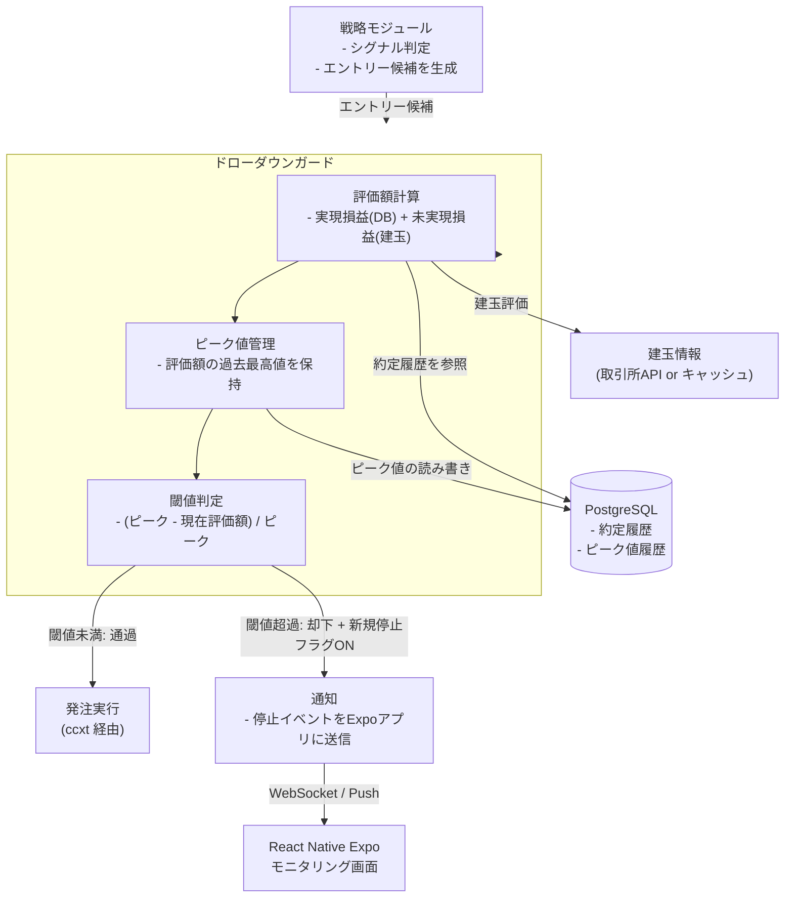

AutoTrader (FastAPI × React Native Expo 製) の自動売買botに、ドローダウン管理の仕組みを組み込んだ。制約は「取引所APIのレート制限内で動かす」「個人が運用する前提でインフラを増やさない」「ロジックのバグで資金を溶かす事故を構造的に防ぐ」の3つ。この記事では、ドローダウンをどこで計算し、どの単位で止めるかという設計判断を中心に書く。

## 前提

### 解きたい問題

自動売買botを動かしていると、シグナルロジック自体は妥当でも、連続して不利なエントリーが重なる局面が必ずある。この局面で「損失が一定を超えたら機械的に止める」仕組みがないと、ロジックのバグや相場急変時に損失が想定外の規模まで膨らむリスクがある。

やりたかったのは次の3点だ。

- 口座残高のピークから現在までの下落率（ドローダウン）を常時監視する
- 一定の閾値を超えたら新規エントリーを止める
- 「止める」判断をロジック本体と分離し、後から閾値を調整しやすくする

「ロジック側にif文を書けばいい」という選択肢もある。ただし戦略コードが複数存在する構成だと、各戦略に同じ制御を埋め込むのは重複だし、閾値変更のたびに複数箇所を触ることになる。ドローダウン管理は横断的な関心事として、独立したレイヤーに切り出す価値があると判断した。

### 環境

- FastAPI 0.111 (バックエンド)
- ccxt (取引所API接続)
- PostgreSQL (残高履歴・約定履歴の保存)
- React Native Expo (モニタリング用フロント)
- 個人運用、VPS 1台

## 設計案の比較

自分が比較した軸は「どの単位でドローダウンを計算するか」「どこで止める判断をするか」の2つ。まず単位の方から書く。

### 案A: 口座残高全体の含み損益から計算する

取引所APIから取得できる口座残高（証拠金 + 未実現損益）をポーリングし、過去の最高値からの下落率を都度計算する。

**メリット**: 実装がシンプル。取引所APIが返す残高情報をそのまま使えるので、ポジション管理ロジックと独立している。

**デメリット**: ポーリング間隔の分だけタイムラグが生じる。また、複数戦略が同一口座で動いている場合、どの戦略の損失が原因かを切り分けられない。

### 案B: 戦略ごとの仮想サブ口座で計算する

戦略ごとに割り当てた資金枠を仮想的に管理し、各戦略の損益をアプリ側のDBで独立して積算する。

**メリット**: 戦略単位でドローダウンを追える。どの戦略が調子が悪いかが明確になり、その戦略だけ止めるという細かい制御ができる。

**デメリット**: 仮想サブ口座の残高計算がアプリ側の実装に依存する。約定履歴の集計漏れや手数料計算のズレがあると、実際の口座残高と乖離する。この乖離自体が新たなバグの温床になりうる。

### 案C: 約定履歴ベースの実現損益 + 未実現損益を組み合わせて計算する（採用）

DBに保存している約定履歴から実現損益を積算し、現在の建玉から未実現損益を都度計算して合算する。この合算値を「時価評価額」として扱い、その最高値からの下落率をドローダウンとする。

**メリット**: 取引所APIのポーリングに依存せず、自前のDBに保存済みのデータで計算できるため、APIレート制限を消費しない。約定履歴という「事実」を起点にしているので、案Bのような乖離が起きにくい。

**デメリット**: 約定履歴の集計ロジックにバグがあると、ドローダウンの数値自体が信用できなくなる。実装時に手数料・スリッページの扱いを丁寧に詰める必要がある。

**案Aと案Cを比較して案Cを選んだ理由**: 案Aは実装が簡単だが、取引所APIへのポーリング頻度を上げるほどレート制限に近づく。ドローダウン監視は「常に見ていたい」種類の処理なので、ポーリング前提の設計とは相性が悪い。自前のDBを正としてリアルタイムに計算できる案Cの方が、レート制限という制約下では持続可能だと判断した。案Bは魅力的だが、仮想口座の乖離という別の問題を抱え込むことになるため、まずは口座全体を1つの単位として扱い、戦略別の内訳は集計クエリで後から取り出せるようにする方針にした。

### 止める判断をどこに置くか

次に、ドローダウンが閾値を超えたときに「誰が止めるか」を比較した。

| 評価軸 | 各戦略にif文を埋め込む | 独立したガードレイヤーを挟む |
|---|---|---|
| 実装の重複 | 戦略の数だけ発生 | 1箇所に集約 |
| 閾値変更の容易さ | 戦略ごとに修正が必要 | 設定値の変更のみ |
| 戦略ロジックとの結合度 | 高い | 低い |
| テストのしやすさ | 戦略テストに混在 | 単体でテスト可能 |

戦略ロジック自体は「シグナルが出たらエントリーする」という関心事に集中させたい。ドローダウン管理という横断的な制御は、注文を発行する直前のレイヤーで一元的に止める設計にした。

## 採用した設計

### 全体アーキテクチャ



戦略モジュールが生成したエントリー候補は、必ずドローダウンガードを経由してから発注される。ガード内では毎回ピーク値を更新し直すのではなく、評価額が過去のピークを更新した場合のみDBに書き込む設計にした。ピーク値は減ることがない値なので、更新条件を「現在評価額 > 保存済みピーク」に絞ることで、無駄な書き込みを減らしている。

### ドローダウン計算のコア部分

```python
# drawdown_guard.py
from dataclasses import dataclass
from decimal import Decimal

@dataclass
class EquitySnapshot:
    realized_pnl: Decimal
    unrealized_pnl: Decimal

    @property
    def equity(self) -> Decimal:
        return self.realized_pnl + self.unrealized_pnl


def calc_drawdown_ratio(current_equity: Decimal, peak_equity: Decimal) -> Decimal:
    if peak_equity <= 0:
        return Decimal("0")
    drawdown = (peak_equity - current_equity) / peak_equity
    return max(drawdown, Decimal("0"))


class DrawdownGuard:
    def __init__(self, max_drawdown_ratio: Decimal):
        self.max_drawdown_ratio = max_drawdown_ratio

    async def check(self, current_equity: Decimal, peak_equity: Decimal) -> bool:
        """True なら発注を許可、False なら却下"""
        ratio = calc_drawdown_ratio(current_equity, peak_equity)
        return ratio < self.max_drawdown_ratio
```

金額計算は `float` ではなく `Decimal` に統一した。取引所APIから返る数値を一度 `float` に変換してから積算すると、丸め誤差が蓄積してドローダウンの数値がわずかにブレる。閾値判定という「止める・止めない」を左右する箇所で誤差が出ると信頼性に関わるため、多少の実装コストを払ってでも `Decimal` を通す判断をした。

### ピーク値の永続化

```python
# peak_repository.py
async def update_peak_if_needed(
    db, account_id: str, current_equity: Decimal
) -> Decimal:
    row = await db.fetchrow(
        "SELECT peak_equity FROM equity_peaks WHERE account_id = $1",
        account_id,
    )
    if row is None:
        await db.execute(
            "INSERT INTO equity_peaks (account_id, peak_equity) VALUES ($1, $2)",
            account_id,
            current_equity,
        )
        return current_equity

    peak = row["peak_equity"]
    if current_equity > peak:
        await db.execute(
            "UPDATE equity_peaks SET peak_equity = $1, updated_at = now() WHERE account_id = $2",
            current_equity,
            account_id,
        )
        return current_equity
    return peak
```

ピーク値をアプリ側のメモリだけで持つ案も検討したが、プロセス再起動時にピークが消えると「本来はドローダウン中なのに、リセットされたピークを基準にすると健全に見える」という危険な状態になる。DBに永続化することで、プロセスが落ちてもピークの連続性を保つようにした。

## 実装上の罠

### 罠1: 未実現損益の評価タイミングでレート制限に接触する

当初、発注のたびに ccxt 経由で最新の建玉評価額を取得していた。エントリー頻度が上がると、この取得処理自体が取引所APIのレート制限にかかるようになった。

対策として、建玉評価額を数秒間キャッシュする層を挟んだ。

```python
import time

_position_cache: dict[str, tuple[float, Decimal]] = {}
CACHE_TTL_SECONDS = 3

async def get_unrealized_pnl_cached(exchange, symbol: str) -> Decimal:
    now = time.time()
    cached = _position_cache.get(symbol)
    if cached and now - cached[0] < CACHE_TTL_SECONDS:
        return cached[1]

    pnl = await fetch_unrealized_pnl(exchange, symbol)
    _position_cache[symbol] = (now, pnl)
    return pnl
```

3秒のキャッシュを許容することで、ドローダウン判定の即時性は多少犠牲になるが、レート制限に触れて発注自体ができなくなる方が致命的だと判断した。

### 罠2: 部分約定時の実現損益の二重計上

約定履歴を積算する際、1つの注文が複数回に分けて部分約定するケースで、同じ注文IDの履歴を重複してカウントしてしまうバグが出た。取引所によって約定通知の粒度が異なり、同一注文に対して複数の約定イベントが飛んでくる。

約定履歴テーブルに `trade_id`（取引所側が発行する一意なID）でユニーク制約をかけ、`INSERT ... ON CONFLICT DO NOTHING` で二重登録を防ぐ形にした。

```sql
CREATE TABLE trade_history (
    trade_id TEXT PRIMARY KEY,
    account_id TEXT NOT NULL,
    realized_pnl NUMERIC NOT NULL,
    executed_at TIMESTAMPTZ NOT NULL
);
```

`trade_id` を主キーにすることで、アプリ側でロジックを組んで重複排除するより、DBの制約に任せた方が確実だと判断した。

### 罠3: 閾値超過後の再開条件を決めていなかった

止める判定は早い段階で作り込んだが、「一度止めた後、いつ再開するか」を最初は決めていなかった。手動で再開フラグを切り替える運用にしていたが、就寝中にドローダウンで止まったまま気づかず、機会損失が発生した。

再開条件として「評価額がピークの一定割合まで回復したら自動再開」というヒステリシス的な閾値を別途設けた。停止した閾値と再開の閾値を同じ値にすると、境界値付近で発注の許可・却下が頻繁に切り替わる挙動になったため、再開閾値は停止閾値より緩めに設定している。

```python
STOP_THRESHOLD = Decimal("0.15")   # 15%下落で停止
RESUME_THRESHOLD = Decimal("0.10")  # 10%まで回復したら再開
```

### 罠4: モニタリング画面への通知が遅延する

React Native Expo 側でドローダウン状態を表示する画面を作ったが、ポーリングで状態を取得する実装にしていたところ、停止イベントの反映が最大数十秒遅れることがあった。WebSocketで停止イベントをプッシュする形に変更し、状態変化があった瞬間にフロント側へ通知するようにした。ポーリング自体は残しつつ、WebSocket切断時のフォールバックとして機能させている。

## 振り返り

約定履歴を起点にドローダウンを計算する設計は、レート制限という制約下では妥当な判断だったと感じている。取引所APIへの依存を減らせたことで、監視の頻度を上げても外部リソースを消費しない構成にできた。

一方で、再開条件を最初の設計に含めていなかったのは反省点だ。「止める」ことにばかり意識が向いていて、「止めた後どうするか」を後回しにしていた。ガードレイヤーを設計するときは、停止条件と復帰条件をセットで最初から検討すべきだったと感じている。

`Decimal` への統一や `trade_id` のユニーク制約など、地味な部分の丁寧さがドローダウン計算の信頼性を左右した。資金を守るための仕組みが誤差やバグで機能しなくなると本末転倒なので、この手の横断的な安全装置は実装の細部まで手を抜かない方がいいという実感を持った。

---

## 関連リンク

[AutoTrader 実装学習キット (FastAPI × React Native)](https://autotrader-lp.onrender.com/)

by ぽん ([@pon_freelance](https://x.com/pon_freelance))

**開発の裏側を購読できます** — AutoTrader のリリースごとに「何を・なぜ・どう変えたか」を 2,000〜4,000 字で書き残しています。バグの原因、取引所 API 変更への追従、設計判断のトレードオフまで。
→ [AutoTrader開発ログ（月500円・いつでも解約可）](https://note.com/clab_jp/membership)
