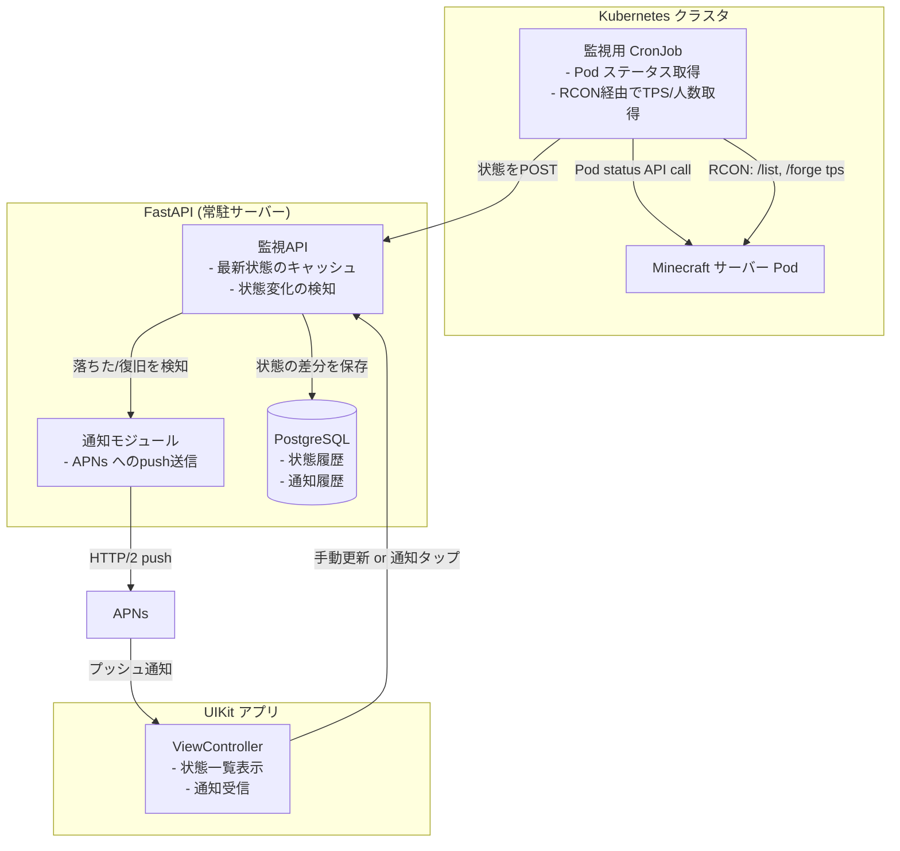

友人と運営しているMinecraftサーバーが、気づくと落ちていることが何度かあった。SSHで入ってログを確認する手間を省きたくて、サーバー状態をスマホで見られる監視アプリ「MineWatch」を作った。目的は監視機能そのものより「App Storeリリースまでの一連の工程を自分の手で経験すること」だった。制約は「UIKitで書く」「バックエンドはFastAPI」「監視対象のMinecraftサーバーはK8s上で動く」の3つ。この記事ではバックエンドの監視設計とリリースフローで詰まった判断を中心に書く。

## 前提

### 解きたい問題

友人数人とMinecraftサーバーを共同運営していて、サーバーはK8s上のPodとして動かしている。落ちる原因はメモリ不足やPod再起動など様々だが、共通しているのは「誰も見ていない時間に落ちて、次にログインした人が気づく」という構図だった。

欲しかったのは次の3点だ。

- サーバーが落ちたらプッシュ通知で気づける
- 現在の同時接続人数やTPS（Tick Per Second）をスマホで確認できる
- 複数人で使うので、誰か一人が見落としても他の誰かが気づける状態にしたい

同時に、今回は「作りたいものを作る」以上に「App Storeに個人アプリを出す経験を積む」ことを目的に据えた。React Native Expoでのリリースは以前に経験していたが、EASによるビルド・提出フローがある程度自動化されている分、Xcodeでのアーカイブ作成や証明書管理といった素の工程には触れていなかった。UIKitを採用したのはそのためで、あえて抽象化されていない工程を踏むことを選んだ。

### 技術スタック

- フロントエンド: UIKit / Swift
- バックエンド: FastAPI
- 監視対象: Kubernetes上のMinecraftサーバー (Pod)
- メトリクス収集: Kubernetes API + RCON
- 通知: APNs (Apple Push Notification service)

### 制約

- 個人＋友人数人の運用規模なので、監視基盤に大きなコストはかけられない
- Minecraftサーバー自体のリソースを監視のために圧迫したくない
- リリースフローは「証明書・プロビジョニングプロファイル・Xcodeのアーカイブ作業」を自分の手で理解しながら進める

## 設計案の比較

### サーバー状態をどう取得するか

Minecraftサーバーの生死や負荷状況を、どの経路で取得するかが最初の設計判断だった。3つの案を比較した。

#### 案A: Minecraftサーバーのログファイルをtailして解析する

サーバーの標準出力ログをFastAPI側で継続的に読み取り、正規表現でプレイヤーの入退室やエラーを検知する。

**メリット**: 追加のプラグインやポート開放が不要。K8sのPodログをそのまま使える。

**デメリット**: ログのフォーマットがMinecraftのバージョンやMod構成によって変わりうる。正規表現が壊れたときの検知が遅れる。TPSのような数値情報はログに出力されないため、別途取得手段が必要になる。

#### 案B: RCON経由でコマンドを叩いて状態を取得する

RCON（Remote Console）プロトコルでMinecraftサーバーに接続し、`/list`や`/forge tps`（Forgeサーバーの場合）などのコマンドで状態を取得する。

**メリット**: プレイヤー数やTPSなど、ログに出ない情報も取得できる。Minecraft標準の仕組みなので追加ミドルウェアが不要。

**デメリット**: RCONのポートを開放する必要があり、サーバーの外部公開面が増える。コマンドのレスポンスはテキストベースで、パースの安定性はMod構成に依存する。

#### 案C: Kubernetes APIでPodのライフサイクル状態を取得し、RCONを状態取得の補助として組み合わせる（採用）

Podの生死・再起動回数・リソース使用量はKubernetes APIから取得し、プレイヤー数やTPSといったゲーム内部の状態だけRCONで補完する構成にした。

**メリット**: 「サーバーが落ちているか」という一番検知したい情報は、Minecraftのプロセスに依存せずK8sのPodステータスから確実に取れる。RCONはあくまで付加情報の取得に限定するため、RCON側で障害が起きても致命的な監視漏れにならない。

**デメリット**: 2つの情報源を扱うため、監視ロジックが単一経路の案よりやや複雑になる。K8s APIのRBAC設定や、監視用のService Accountを別途用意する手間が発生する。

**案Bと案Cを比較して案Cを選んだ理由**: RCON単体に頼ると、RCON接続自体がタイムアウトした場合に「サーバーが落ちている」のか「RCONだけ応答していない」のかを区別できない。実際に検証中、Pod自体は生きているのにRCONへの接続が一時的に詰まる場面があった。K8sのPodステータスという、Minecraftのプロセス状態とは独立した情報源を「生死判定の正」として持ち、RCONは「詳細情報の取得」という役割に限定することで、誤検知のリスクを減らせると判断した。

### 通知の送信経路: FastAPIから直接APNs vs 中継サービスを挟む

| 評価軸 | FastAPIから直接APNs | Firebase Cloud Messaging経由 |
|---|---|---|
| 実装コスト | ○（証明書設定のみ） | △（別サービスの導入） |
| 依存の少なさ | ◎（Apple公式のみ） | △（Google依存が増える） |
| iOS単一プラットフォームへの適合 | ◎ | △（Android対応前提の機能が過剰） |
| 運用の手軽さ | ○ | ○ |

MineWatchはiOSのみをターゲットにしているため、Android対応を見据えた中継サービスを挟む理由がなかった。証明書ベースの認証さえ乗り越えれば、FastAPIからAPNsへ直接HTTP/2でリクエストを送る構成の方がシンプルだと判断した。

## 採用した設計

### 全体アーキテクチャ



Kubernetes CronJobを監視の起点にした。常駐プロセスとして監視ループをFastAPI側に持つ案も検討したが、監視対象のPodと同じクラスタ内にCronJobとして置くことで、Pod間通信がクラスタ内で完結し、外部への露出面を増やさずに済む。CronJobは1分間隔で実行し、取得した状態をFastAPIにPOSTする一方向の設計にした。

### 状態変化検知のコア部分

```python
# state_watcher.py
from dataclasses import dataclass
from enum import Enum

class ServerStatus(str, Enum):
    RUNNING = "running"
    CRASHED = "crashed"
    UNKNOWN = "unknown"

@dataclass
class ServerState:
    status: ServerStatus
    player_count: int | None
    tps: float | None

def detect_transition(previous: ServerState, current: ServerState) -> str | None:
    """状態遷移があれば通知すべきメッセージを返す。なければNone"""
    if previous.status == ServerStatus.RUNNING and current.status == ServerStatus.CRASHED:
        return "サーバーが停止しました"
    if previous.status == ServerStatus.CRASHED and current.status == ServerStatus.RUNNING:
        return "サーバーが復旧しました"
    return None
```

通知を送るのは「状態が変化した瞬間」だけに絞った。CronJobは1分ごとに動くため、単純に「現在CRASHEDなら毎回通知する」実装にすると、復旧するまで1分おきに通知が飛び続けてしまう。前回の状態をDBに保存しておき、遷移があった場合だけ通知を出すことで、通知疲れを避けている。

### RCON接続のタイムアウト設計

```python
# rcon_client.py
import asyncio
from mcrcon import MCRcon

RCON_TIMEOUT_SECONDS = 3

async def fetch_game_state(host: str, password: str) -> dict | None:
    loop = asyncio.get_event_loop()
    try:
        return await asyncio.wait_for(
            loop.run_in_executor(None, _fetch_sync, host, password),
            timeout=RCON_TIMEOUT_SECONDS,
        )
    except asyncio.TimeoutError:
        # RCONが詰まっていてもPodの生死判定には影響させない
        return None

def _fetch_sync(host: str, password: str) -> dict:
    with MCRcon(host, password) as mcr:
        list_result = mcr.command("list")
        tps_result = mcr.command("forge tps")
        return {"list": list_result, "tps": tps_result}
```

RCON接続がタイムアウトした場合は`None`を返し、呼び出し側では「TPSや人数は不明だが、Podは生きている」という状態として扱う。RCONの失敗を「サーバー停止」と混同しないよう、明確に情報源を分離した設計にしている。

## 実装上の罠

### 罠1: Provisioning ProfileとBundle IDの不一致

Expoでのリリース経験はあったが、EASが自動生成・管理していた証明書とプロビジョニングプロファイルの対応関係を、今回は手動でXcode上から追う必要があった。開発用のプロビジョニングプロファイルのままアーカイブを作成し、App Store Connectへのアップロード時に「Invalid Provisioning Profile」で弾かれる、という失敗を最初にやった。

Distribution用の証明書とApp Store用のプロビジョニングプロファイルを別途作成し、Xcodeの署名設定を`Automatically manage signing`から手動選択に切り替えて、どのプロファイルが使われているかを都度確認する運用にした。EASが裏で何をやっていたかを、ここで初めて実感として理解できた。

### 罠2: APNsのプッシュ証明書がSandbox/Productionで別物

開発中はSandbox環境のAPNs証明書で通知を送っていたが、TestFlightに配布したビルドではSandbox証明書からの通知が届かなかった。TestFlightおよび本番ビルドはProduction環境のAPNsを参照するため、証明書もエンドポイントも別に用意する必要がある。

```python
# apns_client.py
import os

APNS_ENV = os.environ.get("APNS_ENV", "sandbox")
APNS_HOST = (
    "api.sandbox.push.apple.com" if APNS_ENV == "sandbox"
    else "api.push.apple.com"
)
```

環境変数でホストを切り替えられるようにし、TestFlight配布用のビルドをアーカイブする際に`APNS_ENV=production`を明示的に指定する運用にした。この切り替えを忘れて「通知が届かない」原因調査に半日溶かした。

### 罠3: K8s Service Accountの権限を絞り込みすぎて監視が止まった

監視用CronJobにRBACで最小権限を与える方針にした際、Podの`get`権限だけを付与し`list`権限を与え忘れた。CronJobがラベルセレクタでPodを検索する処理で`list`が必要だったため、権限エラーで監視自体が動かなくなった。

```yaml
# rbac.yaml
apiVersion: rbac.authorization.k8s.io/v1
kind: Role
metadata:
  name: minewatch-monitor
rules:
  - apiGroups: [""]
    resources: ["pods"]
    verbs: ["get", "list", "watch"]
```

最小権限の原則自体は維持しつつ、「Podを名前で取得する」操作と「ラベルで検索する」操作は別の権限が必要という点を、エラーログを見てから気づいた。権限設計は動作確認とセットで進めるべきだったと感じた箇所だ。

## 振り返り

RCONとKubernetes APIを情報源として分離した設計は、狙い通りに機能した。実際の運用で一度RCON接続が数分詰まる場面があったが、Pod自体は生きていたため誤って「サーバー停止」の通知が飛ぶことはなかった。生死判定と詳細情報取得を別の経路に置く判断は、監視の信頼性という観点で妥当だったと思う。

UIKitでの開発とネイティブなリリースフローを選んだ判断についても、当初の目的は達成できた。EASが自動化していた証明書管理やビルドの署名周りを手作業で追うことで、これまで「なんとなく通っていた」工程の意味を理解できたのは収穫だった。一方で、この手間を毎回の個人開発案件で背負うのは非効率だとも感じた。今回のように「学習が目的のプロジェクト」と「素早くリリースしたいプロジェクト」で、ツールの抽象化レベルを意図的に使い分けるのが現実的な落とし所だと考えている。

権限設計やSandbox/Production環境の切り替えなど、地味な部分で足を止められる場面が多かった。個人開発でインフラからリリースまで一通り自分で触ると、普段フレームワークやマネージドサービスが吸収してくれている工程の多さを実感する。次に似た構成のアプリを作るときは、今回詰まった箇所をチェックリスト化してから着手したい。

---

## 関連リンク

[AutoTrader 実装学習キット (FastAPI × React Native)](https://autotrader-lp.onrender.com/?utm_source=zenn&utm_medium=article&utm_campaign=%E5%80%8B%E4%BA%BA%E9%96%8B%E7%99%BA%E3%81%A7app-store%E3%83%AA%E3%83%AA%E3%83%BC%E3%82%B9%E3%83%95%E3%83%AD%E3%83%BC%E3%82%92%E5%AD%A6%E3%81%B6-uikit-fastapi-k8s%E3%81%A7%E4%BD%9C%E3%82%8Bminecraft%E3%82%B5%E3%83%BC%E3%83%90%E3%83%BC%E7%9B%A3%E8%A6%96)

by ぽん ([@pon_freelance](https://x.com/pon_freelance))

**開発の裏側を購読できます** — AutoTrader のリリースごとに「何を・なぜ・どう変えたか」を 2,000〜4,000 字で書き残しています。バグの原因、取引所 API 変更への追従、設計判断のトレードオフまで。
→ [AutoTrader開発ログ（月500円・いつでも解約可）](https://note.com/clab_jp/membership)
