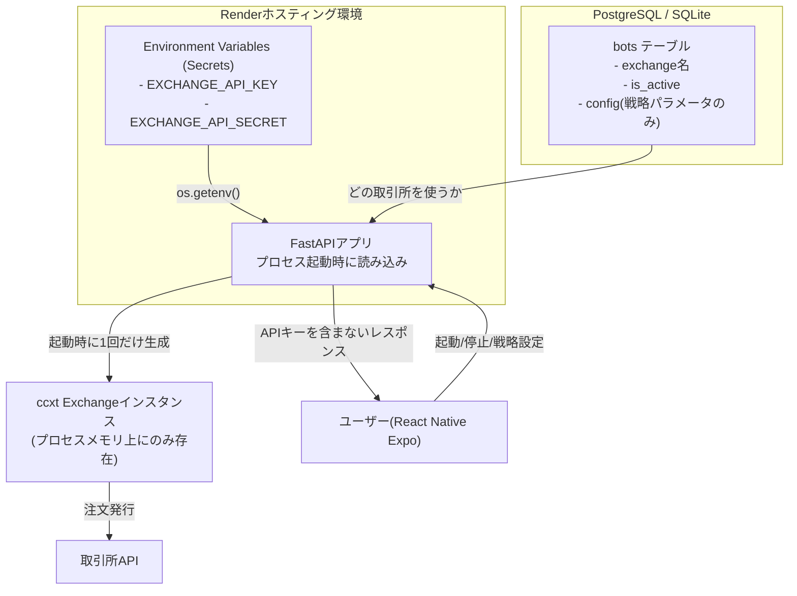

AutoTrader (FastAPI × React Native Expo 製) では、ユーザーが自分の取引所APIキーを登録して自動売買を動かす構成をとっている。制約は「個人開発でインフラコストをかけられない」「セルフホスト前提でユーザーごとに環境が異なる」「APIキー漏洩は資金流出に直結する」の3つ。この記事では、APIキーをどこにどう保管するかという設計判断を中心に書く。

## 前提

### 解きたい問題

自動売買botは、取引所APIキーがないと何もできない。同時に、このAPIキーは漏洩した瞬間に資金が抜かれるリスクを持つ、最も守るべき情報でもある。

AutoTraderの構成上、APIキーの扱いには以下の制約があった。

- ユーザーが自分でRenderなどにデプロイして使うセルフホスト型なので、鍵管理サービスを強制導入できない
- DBはSQLite/PostgreSQLの両対応で、DBファイル自体が流出するケースも想定する必要がある
- フロント（React Native Expo）側にAPIキーの生データを持たせたくない

「暗号化してDBに保存すればいい」という案は最初からあった。ただし、暗号化キー自体をどこに置くかという堂々巡りの問題が残る。結局、**何を環境変数に出し、何をDBに置くか**の線引きが設計の核になった。

### 環境

- FastAPI 0.111（バックエンド）
- ccxt（14取引所のAPIキーを扱う）
- PostgreSQL / SQLite（開発・本番で切り替え）
- Render（本番ホスティング、Environment Variables機能を使用）
- React Native Expo（モニタリング用フロント、APIキーの生データは扱わない）

## 設計案の比較

比較したのは「取引所APIキーをどこに保存するか」という1点に尽きる。評価軸は「漏洩時の被害範囲」「実装コスト」「セルフホスト運用との相性」の3つ。

### 案A: DBに平文で保存する

シンプルにテーブルのカラムにAPIキー・シークレットをそのまま入れる。

**メリット**: 実装が一番簡単。マイグレーションもクエリも素直に書ける。

**デメリット**: DBファイル（SQLite）やDBダンプが流出したら、その瞬間に全ユーザーのAPIキーが漏れる。バックアップの取り扱いミス1つで致命傷になる。

### 案B: DBにアプリ側の鍵で暗号化して保存する

`cryptography`ライブラリ等でAPIキーを暗号化し、暗号文だけをDBに置く。復号用の鍵はアプリ側が持つ。

**メリット**: DBが単体で流出しても、暗号化キーがなければ復号できない。案Aよりは被害範囲を絞れる。

**デメリット**: 復号キーをどこに置くかという問題がそのまま残る。結局この鍵をコードに埋め込んだりDBの別テーブルに置いたりすると、暗号化そのものが形骸化する。鍵のローテーションを考え始めると管理コストが跳ね上がり、個人開発の運用体力に見合わない。

### 案C: 環境変数（Secrets管理）にAPIキーを置き、DBには「取引所名」と「有効/無効フラグ」だけを持つ（採用）

APIキーの生データはRenderのEnvironment Variables（Secrets）にのみ保存し、アプリ本体からは`os.getenv()`で読むだけにする。DBにはAPIキー自体を一切書かない。

**メリット**: DBダンプが流出してもAPIキーは含まれないため、被害範囲がDB経由の漏洩に対して閉じる。Renderなどのホスティング側がSecrets管理（暗号化保存・アクセス権限分離）を担ってくれるので、自前で暗号化の仕組みを実装・運用する必要がない。

**デメリット**: 複数ユーザーがそれぞれ別々のAPIキーを使う「マルチテナント」的な運用には向かない。ユーザーが増えるたびに環境変数を手動で追加する必要があり、動的な鍵の追加には弱い。

**案Bと案Cを比較して案Cを選んだ理由**: 案Bは「暗号化しているから安全」という見た目にはなるが、復号鍵の管理という同じ問題を一段階先送りしているだけだった。個人開発でKMS(Key Management Service)のようなものを別途運用するのは明らかにオーバーエンジニアリングで、コストに見合わない。一方、AutoTraderはユーザーが自分のサーバーに自分の環境変数を設定して使うセルフホスト前提のアプリなので、「1インスタンス=1ユーザー(またはごく少数)」という運用モデルと環境変数方式の相性がよかった。ホスティング側のSecrets機能に鍵管理を委譲し、自分は「DBにAPIキーを書かない」という制約を守ることに集中する方が、実装コストと安全性のバランスが取れると判断した。

## 採用した設計

### 全体アーキテクチャ



DBに保存するのは「どの取引所を使うか」「Botが有効かどうか」「戦略のパラメータ」だけで、APIキーそのものは一切含めない。ccxtのExchangeインスタンスはプロセス起動時に環境変数から作られ、以降はメモリ上に保持し続ける設計にした。

### 環境変数からのExchangeインスタンス生成

```python
# exchange_factory.py
import os
import ccxt.async_support as ccxt

_exchange_cache: dict[str, ccxt.Exchange] = {}

def get_exchange(exchange_name: str) -> ccxt.Exchange:
    if exchange_name in _exchange_cache:
        return _exchange_cache[exchange_name]

    api_key = os.getenv(f"{exchange_name.upper()}_API_KEY")
    api_secret = os.getenv(f"{exchange_name.upper()}_API_SECRET")

    if not api_key or not api_secret:
        raise RuntimeError(
            f"{exchange_name} のAPIキーが設定されていません。"
            f"環境変数 {exchange_name.upper()}_API_KEY を確認してください。"
        )

    exchange_class = getattr(ccxt, exchange_name)
    instance = exchange_class({
        "apiKey": api_key,
        "secret": api_secret,
        "enableRateLimit": True,
    })
    _exchange_cache[exchange_name] = instance
    return instance
```

インスタンスをキャッシュしているのは、`ccxt`のExchangeオブジェクト生成コスト自体はそこまで高くないが、コネクションプールやレート制限管理を取引所単位で使い回すためだ。プロセス内で1度作ったら使い回すことで、無駄な初期化を避けている。

### レスポンスからAPIキーを除外する

DBにAPIキーを書いていなくても、実装ミスでレスポンスに紛れ込ませてしまうリスクは別途ある。念のため、Botの設定を返すエンドポイントでは明示的にフィルタをかけている。

```python
# schemas.py
from pydantic import BaseModel

class BotConfigResponse(BaseModel):
    exchange: str
    is_active: bool
    strategy: str
    strategy_params: dict

    class Config:
        # APIキーに類する項目が万一config辞書に混入していても
        # レスポンススキーマに定義がなければ自動的に除外される
        extra = "ignore"
```

Pydanticのレスポンスモデルを「返してよい項目だけ」を明示するホワイトリスト方式にした。ブラックリスト方式（「APIキーっぽいキーを除外する」)ではなく、返す項目を列挙する方式にしたのは、将来カラムが増えたときに除外漏れが起きるのを構造的に防ぎたかったからだ。

## 実装上の罠

### 罠1: ログにAPIキーが出力される

`ccxt`は例外発生時にリクエストパラメータをそのまま例外メッセージに含めることがある。これをそのまま`logger.error(str(e))`のように出力すると、APIキーがログファイルに残ってしまう。

```python
try:
    order = await exchange.create_order(symbol, "market", side, amount)
except Exception as e:
    # 生の例外メッセージにAPIキーが含まれる可能性があるため、
    # 既知のパターンでマスクしてからログ出力する
    masked = _mask_secrets(str(e))
    logger.error(f"注文失敗: {masked}")
```

```python
import re

def _mask_secrets(text: str) -> str:
    # apiKey=xxxxx のようなクエリパラメータ形式を伏字にする
    return re.sub(r"(apiKey|secret)=[^&\s]+", r"\1=***", text)
```

Render側のログもSecretsではなく通常のログとして扱われるため、ここで漏れると環境変数を分離した意味が薄れる。ログ出力の直前に必ずマスク処理を通す運用にした。

### 罠2: `.env`ファイルをローカル開発でうっかりコミットする

ローカル開発時は`.env`ファイルに`EXCHANGE_API_KEY`を書いて`python-dotenv`で読み込む構成にしている。`.gitignore`に`.env`を入れていても、`git add .`を無警戒に叩くと過去に一度コミットしてしまった履歴が残ることがある。

対策として、`.env.example`だけをリポジトリに置き、実際の値はダミーにした。

```
# .env.example
BITFLYER_API_KEY=your_api_key_here
BITFLYER_API_SECRET=your_api_secret_here
```

加えて、pre-commitフックで`.env`のステージングを検知したらコミット自体をブロックするようにした。地味だが、一度うっかりコミットして履歴からの削除に半日かけた経験から入れた仕組みだ。

### 罠3: 環境変数の読み込みタイミングとプロセス再起動

Renderで環境変数を変更すると、反映には再デプロイ(またはプロセス再起動)が必要になる。APIキーをローテーションした直後、「変更したのに古いキーで動いている」という状態に遭遇した。

原因は、`get_exchange()`のキャッシュがプロセスメモリ上に残り続けていたことだった。環境変数自体は更新されていても、既にキャッシュされたExchangeインスタンスは古いキーを保持したままになる。

```python
# キャッシュクリア用のエンドポイント（運用担当者のみが叩く想定）
@router.post("/internal/reload-exchange-cache")
async def reload_exchange_cache():
    _exchange_cache.clear()
    return {"status": "cache cleared"}
```

このエンドポイントを認証必須にしたうえで用意し、APIキーをローテーションした際は明示的に叩く運用にした。プロセスを再起動すれば自然にキャッシュは消えるが、無停止でキーを切り替えたい場面もあるため、明示的なクリア手段を残している。

### 罠4: フロントに設定画面を作ったときの入力欄

React Native Expo側の設定画面で「APIキーを入力する」欄を一時的に検討したことがあった。セルフホスト型なので、ユーザーがアプリ経由でサーバーの環境変数を書き換えられたら便利ではという発想だったが、これは実装しなかった。

理由は、アプリ→サーバー間の通信経路にAPIキーを流す時点で、漏洩経路が1つ増えるからだ。環境変数はサーバー管理者(≒ユーザー本人)がRenderの管理画面から直接設定する運用に固定し、アプリ側にはAPIキー入力欄を一切持たせない設計にした。利便性より、経路を増やさないことを優先した判断になる。

## 振り返り

APIキーの保管場所を「DBか環境変数か」で悩んだ時間は長かったが、最終的には「暗号化を自前で頑張る」より「そもそも危険な情報をDBに置かない」という引き算の設計に落ち着いた。個人開発でセルフホスト前提のアプリだからこそ、ホスティング側のSecrets機能に素直に乗る判断が合っていたと感じている。

一方で、ログへの混入やキャッシュの再読み込みタイミングなど、「環境変数に置いたから安全」で終わらせず、周辺の細部を丁寧に詰める必要があるとも実感した。APIキーは1箇所守れば終わりではなく、ログ・レスポンス・キャッシュ、それぞれの経路で漏れないかを個別に点検する作業が地味に効いてくる。

資金に直結する情報を扱う以上、「便利だからアプリに入力欄を作る」といった機能追加は一度立ち止まって、漏洩経路を増やしていないかを確認する習慣をつけるようにしている。

---

## 関連リンク

[AutoTrader 実装学習キット (FastAPI × React Native)](https://autotrader.ponfreelance.com/sales/?utm_source=zenn&utm_medium=article&utm_campaign=%E5%8F%96%E5%BC%95%E6%89%80api%E3%82%AD%E3%83%BC%E3%81%AE%E5%AE%89%E5%85%A8%E3%81%AA%E4%BF%9D%E7%AE%A1-%E7%92%B0%E5%A2%83%E5%A4%89%E6%95%B0-secrets)

by ぽん ([@pon_freelance](https://x.com/pon_freelance))

**開発の裏側を購読できます** — AutoTrader のリリースごとに「何を・なぜ・どう変えたか」を 2,000〜4,000 字で書き残しています。バグの原因、取引所 API 変更への追従、設計判断のトレードオフまで。
→ [AutoTrader開発ログ（月500円・いつでも解約可）](https://note.com/clab_jp/membership)
