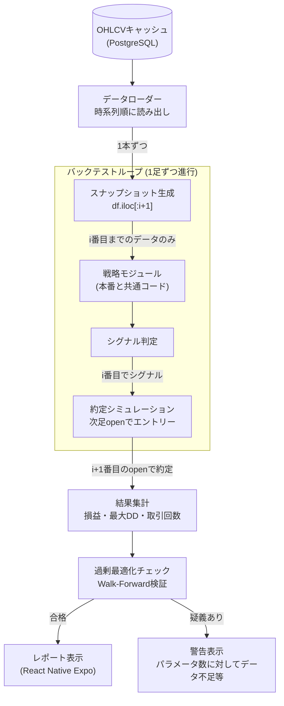

AutoTrader (FastAPI × React Native Expo 製) にバックテスト機能を実装する過程で、ルックアヘッドバイアス（未来のデータを見てしまう設計ミス）に何度も引っかかった。制約は「OHLCVデータはローソク足単位でしか取得できない」「戦略コードは本番実行とバックテストで共通化したい」「個人開発なので検証用の別基盤は作れない」の3つ。この記事では、バックテストの結果を信用できる形にするための設計判断を中心に書く。

## 前提

### 解きたい問題

バックテストは「過去のデータに対して戦略を走らせて、どれくらい利益が出たかを見る」機能だが、実装を素直に書くと簡単に未来を覗き見てしまう。典型的なのは以下のパターンだ。

- そのローソク足の`close`値を使ってシグナルを判定し、同じ足の`close`値でエントリーする（実際は足が確定する前にエントリーできない）
- 指標計算に未来のデータを含めてしまう（移動平均の窓がずれている等）
- 最適化のためにパラメータを何度も変えて一番成績が良かった設定を採用する（過剰最適化、いわゆるカーブフィッティング）

これらは実装ミスというより、設計上「未来のデータにアクセスできてしまう構造」を放置した結果として起きる。AutoTraderでは戦略コードを本番稼働とバックテストで共通化しているため、この共通化のやり方自体がバイアスの温床になりやすかった。

やりたかったことは次の3点。

- 戦略コードが参照できるデータを、その時点で本当に取得可能だった範囲に強制的に限定する
- エントリー価格を「シグナルが出た足のclose」ではなく「次の足のopen」にする
- パラメータ最適化をしても、それが過剰最適化かどうかを検知できる仕組みを入れる

### 環境

- FastAPI 0.111（バックエンド）
- ccxt（過去OHLCV取得）
- pandas（バックテスト内のデータ処理）
- PostgreSQL（OHLCVキャッシュ、バックテスト結果の保存）
- 個人開発、戦略モジュールは本番/バックテスト共通

## 設計案の比較

比較したのは「戦略コードにデータをどう渡すか」という1点。ここの設計がルックアヘッドバイアスの起きやすさを大きく左右する。

### 案A: 全期間のDataFrameをそのまま戦略関数に渡す

過去データを全部読み込んだ`DataFrame`を戦略関数に渡し、戦略側で`df.rolling()`などを使って指標を計算する。

**メリット**: 実装が一番簡単。pandasのベクトル演算がそのまま使えるので、バックテストの実行速度も速い。

**デメリット**: 戦略コード側が「今何行目まで見ていいか」を意識せず、`df`全体にアクセスできてしまう。移動平均の窓をうっかり`center=True`にする、未来の行を`shift(-1)`で参照するなど、些細なミスが混入する余地が大きい。本番稼働時は当然全期間のデータなど存在しないので、戦略コードの共通化が崩れる。

### 案B: 各時点でのスナップショットDataFrameを都度生成して渡す

ループの各ステップで「その時点までのデータだけを含むDataFrame」を都度スライスして戦略関数に渡す。

**メリット**: 戦略関数は物理的に未来のデータへアクセスできない。本番稼働時も「現在までの直近N本」を渡す構造にすれば、バックテストと同じインターフェースを維持できる。

**デメリット**: 毎ステップDataFrameをスライスするコストがかかり、バックテストの実行速度が案Aより落ちる。長期間・短い足でのバックテストだと数秒〜数十秒の差になる。

### 案C: イベント駆動でローソク足を1本ずつ戦略に流し込む

ヒストリカルデータを時系列順に1本ずつ読み出し、その都度「イベント」として戦略に渡す。戦略側は過去に受け取ったデータだけを内部状態として保持する。

**メリット**: 本番稼働の仕組み（WebSocketやポーリングで1本ずつ足が確定していく）と最も近い構造になる。ルックアヘッドが構造的に発生しえない。

**デメリット**: 実装がもっとも重い。既存の戦略コードが`pandas`のベクトル演算を前提に書かれている場合、逐次処理への書き換えコストが大きい。個人開発の工数として現実的でない部分があった。

**案Bと案Cを比較して案Bを選んだ理由**: 案Cが理想に近いのは理解していたが、既存の戦略モジュール（DCA、ルールベース、AI戦略など複数）をすべて逐次処理に書き直すコストが見合わなかった。案Bであれば「スナップショットを渡す」というインターフェースの制約だけを守れば、戦略内部の実装（pandasのベクトル演算含む）はそのまま活かせる。実行速度の低下は許容範囲内（バックテスト1回が数十秒伸びる程度）だったため、安全性と移行コストのバランスで案Bを採用した。

## 採用した設計

### 全体アーキテクチャ



ループの各ステップで`df.iloc[:i+1]`のようにその時点までのデータだけを切り出し、戦略モジュールに渡す。戦略がシグナルを出しても、その足の`close`では約定させず、次の足の`open`で約定させる。これによって「シグナルが出た瞬間にその足の終値で買える」という非現実的な前提を排除している。

### スナップショットを渡すコア部分

```python
# backtest_runner.py
import pandas as pd
from decimal import Decimal

def run_backtest(df: pd.DataFrame, strategy) -> list[dict]:
    trades = []
    position = None

    for i in range(len(df) - 1):
        # その時点までのデータだけを渡す（未来の行は物理的に含まれない）
        snapshot = df.iloc[: i + 1]
        signal = strategy.judge(snapshot)

        if signal == "buy" and position is None:
            # シグナルが出た足のcloseではなく、次の足のopenで約定させる
            fill_price = Decimal(str(df.iloc[i + 1]["open"]))
            position = {"entry_price": fill_price, "entry_index": i + 1}

        elif signal == "sell" and position is not None:
            fill_price = Decimal(str(df.iloc[i + 1]["open"]))
            pnl = fill_price - position["entry_price"]
            trades.append({"pnl": pnl, "exit_index": i + 1})
            position = None

    return trades
```

`strategy.judge()`に渡す`snapshot`は`df.iloc[:i+1]`で切り出しているため、戦略側のコードがどれだけ`df`全体を触るようなロジックを書いても、物理的にその時点以降のデータは存在しない。本番稼働時も同様に「直近N本のスナップショット」を組み立てて`judge()`に渡す構造にしており、戦略モジュール自体は本番とバックテストで完全に共通のコードを使っている。

### 過剰最適化を検知するWalk-Forward検証

パラメータチューニングをすると、特定期間に対して成績が良くなるようにパラメータを追い込みがちになる。これ自体は悪いことではないが、その期間にだけ効くパラメータを「有効な戦略」と誤認するリスクがある。

対策として、期間を学習用と検証用に分割し、学習用期間で最適化したパラメータを検証用期間でそのまま評価するWalk-Forward形式を採用した。

```python
# walk_forward.py
def walk_forward_check(df: pd.DataFrame, optimize_fn, strategy_cls) -> dict:
    split_point = int(len(df) * 0.7)
    train_df = df.iloc[:split_point]
    test_df = df.iloc[split_point:]

    best_params = optimize_fn(train_df, strategy_cls)
    train_result = run_backtest(train_df, strategy_cls(**best_params))
    test_result = run_backtest(test_df, strategy_cls(**best_params))

    train_return = sum(t["pnl"] for t in train_result)
    test_return = sum(t["pnl"] for t in test_result)

    # 学習期間の成績と検証期間の成績が大きく乖離していたら警告
    degradation = (train_return - test_return) / abs(train_return) if train_return != 0 else 0
    return {
        "train_return": train_return,
        "test_return": test_return,
        "degradation_ratio": degradation,
        "suspicious": degradation > 0.5,  # 経験的な閾値
    }
```

`degradation_ratio`が大きい場合、学習期間だけに過剰適合したパラメータである可能性が高いと判断し、レポート画面に警告を表示するようにした。閾値0.5は厳密な統計的根拠があるわけではなく、自分の運用感覚から置いた値だが、「何も検知しない」状態よりは大きく前進したと考えている。

## 実装上の罠

### 罠1: 指標計算そのものにルックアヘッドが混入する

移動平均やRSIなど、`pandas`の`rolling()`を使う指標計算で、意図せず未来のデータを参照してしまうケースがあった。原因は、スナップショットを渡す前の段階で指標列を事前計算してDataFrameに追加していたことだった。

```python
# NG: 事前に全期間分の指標を計算してからスナップショットを切り出す
df["sma_20"] = df["close"].rolling(20).mean()
snapshot = df.iloc[: i + 1]  # 一見安全に見えるが、rolling(20)の計算自体は既に全期間で終わっている
```

`rolling()`自体は各行までのデータしか参照しないので一見問題なさそうだが、`center=True`を指定していた別の指標計算で未来の値を含めてしまっていたことがあった。以降、指標計算は必ずスナップショットを切り出した後に行う運用に統一した。

```python
# OK: スナップショットを切り出してから指標を計算する
snapshot = df.iloc[: i + 1]
snapshot = snapshot.assign(sma_20=snapshot["close"].rolling(20).mean())
```

事前計算の方が実行速度は速いが、「スナップショットを切ってから計算する」という順序を徹底することを優先した。速度よりも、戦略コードが未来のデータに触れる余地をなくすことの方が重要だと判断した。

### 罠2: 出来高でのフィルタが未来の情報を含んでいた

ある戦略で「出来高が直近20本の平均を上回ったらエントリー」という条件を入れていたが、平均の計算範囲に当該足自身を含めてしまっていた。当該足の出来高はその足が確定するまで完全には確定しない（取引所によっては未確定足の出来高が更新され続ける）ため、この条件は本番では成立しない判定だった。

```python
# NG: 当該足自身を平均の計算に含めている
avg_volume = snapshot["volume"].tail(20).mean()
if snapshot.iloc[-1]["volume"] > avg_volume:
    signal = "buy"
```

```python
# OK: 当該足を除いた直近20本で平均を計算する
avg_volume = snapshot["volume"].iloc[-21:-1].mean()
if snapshot.iloc[-1]["volume"] > avg_volume:
    signal = "buy"
```

バックテスト結果を見ていて、成績が理論値より良すぎる（実運用の感覚と乖離している）ことに気づき、この計算範囲のズレを発見した。バックテストの成績が「良すぎる」と感じたときは、まず計算範囲にバイアスが混入していないかを疑う習慣がついた。

### 罠3: 約定価格の仮定が甘い

次の足の`open`で約定させる設計にしていても、実際には取引所の板の厚みやスリッページを考慮していなかった。バックテスト上は理想的な価格で全量約定する前提になっており、これも「成績が良すぎる」原因の一つだった。

固定のスリッページ率を約定価格に加減する簡易的な補正を入れた。

```python
SLIPPAGE_RATE = Decimal("0.0005")  # 0.05%

def apply_slippage(price: Decimal, side: str) -> Decimal:
    if side == "buy":
        return price * (1 + SLIPPAGE_RATE)
    return price * (1 - SLIPPAGE_RATE)
```

厳密な板情報を使ったシミュレーションではないが、何も考慮しない状態よりは実運用に近い数値になった。ここは今後の改善余地として残している。

### 罠4: バックテスト結果のキャッシュが古いロジックのまま表示される

戦略モジュールを修正した後、以前のバックテスト結果がキャッシュされたままフロントに表示され続けるという事故があった。バックテストIDと戦略コードのバージョンを紐付けていなかったことが原因で、修正前の結果を見て「この戦略は成績が良い」と誤認しかけた。

戦略コードのハッシュ値をバックテスト結果に含めて保存し、戦略が変更されたら過去の結果を再利用しない形に修正した。

```python
import hashlib
import inspect

def strategy_version_hash(strategy_cls) -> str:
    source = inspect.getsource(strategy_cls)
    return hashlib.sha256(source.encode()).hexdigest()[:12]
```

## 振り返り

バックテストの罠は、コードの誤字脱字よりも「その時点で本当に得られたはずの情報かどうか」という設計上の見落としから発生しやすいと実感した。スナップショットを都度切り出す設計にしたことで、戦略コード側に「未来を見ない」という制約を構造的に強制できたのは良かった点だと思う。

一方で、出来高フィルタの計算範囲のズレのように、指標一つひとつに個別のバイアスが潜んでいる可能性は依然として残る。「バックテストの成績が良すぎると感じたら疑う」という感覚は、今回の実装を通して身についた数少ない収穫だった。

Walk-Forward検証も、完璧に過剰最適化を排除できる仕組みではなく、あくまで「疑わしさを可視化する」程度の役割だと捉えている。バックテストは過去のデータに対する検証でしかなく、将来の成績を保証するものではないという前提を忘れずに、警告が出た結果は鵜呑みにしない運用を自分自身にも課している。

---

## 関連リンク

[AutoTrader 実装学習キット (FastAPI × React Native)](https://autotrader.ponfreelance.com/sales/?utm_source=zenn&utm_medium=article&utm_campaign=%E3%83%90%E3%83%83%E3%82%AF%E3%83%86%E3%82%B9%E3%83%88%E3%81%A7%E9%99%A5%E3%82%8B%E8%90%BD%E3%81%A8%E3%81%97%E7%A9%B4-%E3%83%AB%E3%83%83%E3%82%AF%E3%82%A2%E3%83%98%E3%83%83%E3%83%89%E3%83%90%E3%82%A4%E3%82%A2%E3%82%B9)

by ぽん ([@pon_freelance](https://x.com/pon_freelance))

**開発の裏側を購読できます** — AutoTrader のリリースごとに「何を・なぜ・どう変えたか」を 2,000〜4,000 字で書き残しています。バグの原因、取引所 API 変更への追従、設計判断のトレードオフまで。
→ [AutoTrader開発ログ（月500円・いつでも解約可）](https://note.com/clab_jp/membership)
