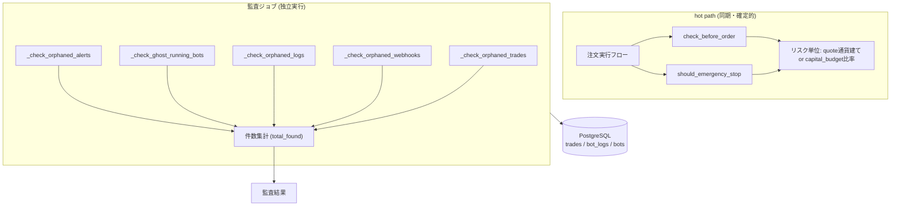

AutoTrader (FastAPI × React Native Expo 製) の自動売買botに、異常検知・監査の仕組みを組み込んだ。制約は「注文実行の同期処理を重くしない」「個人運用でインフラを増やさない」「通貨単位を跨ぐbotが混在しても誤発火させない」の3つ。この記事では、異常検知をどこで・どの単位で走らせるかという設計判断を中心に書く。

## 前提

### 解きたい問題

複数のbotが同時に稼働していると、「注文自体は成功しているのに集計上おかしい」「botのステータスが実態と食い違っている」といった異常が、ロジックのバグ以外の経路でも発生しうる。手動取引の混入、Webhookの紐付けミス、プロセスクラッシュ後のステータス不整合など、原因は多岐にわたる。

AutoTraderでは、この種の異常を検知する処理を `audit.py` に集約している。

```python
# backend/audit.py:30
results.append(_check_orphaned_trades(db))
results.append(_check_orphaned_webhooks(db))
results.append(_check_orphaned_logs(db))
results.append(_check_ghost_running_bots(db))
results.append(_check_orphaned_alerts(db))

total_found = sum(r["found"] for r in results)
```

孤立した取引・孤立したWebhook・孤立したログ・「RUNNINGのはずなのに実体がない幽霊bot」・孤立したアラート、という5種類のチェックを1回の監査でまとめて実行し、件数を集計する形になっている。

やりたかったことは大きく2つ。

- 注文実行やリスク判定という「取引を左右する処理(hot path)」を、異常検知の重さで遅延させない
- 通貨単位が異なるbot（例: JPY建てとUSDT建て）が同居する構成で、閾値判定を誤らせない

この2点は、後述するように実際に事故につながった経験から出てきた制約でもある。

### 環境

- FastAPI (バックエンド)
- ccxt (取引所API接続)
- PostgreSQL (Trade / bot_logs / bots テーブル)
- Alembic (スキーマ管理、baselineから運用中)
- React Native Expo (モニタリング用フロント)
- 個人運用

## 設計案の比較

比較したのは「異常検知・リスク判定のロジックを、どのタイミング・どの粒度で走らせるか」という軸。評価軸は「hot pathへの影響」「検知の即時性」「通貨単位の扱いやすさ」の3つ。

### 案A: 注文実行の都度、リスク判定と一緒に整合性チェックも行う

`check_before_order` や `should_emergency_stop` の中で、孤立レコードの有無やbotステータスの整合性まで毎回確認する。

**メリット**: 異常があれば即座に検知できる。別途バッチを用意する必要がない。

**デメリット**: リスク判定は同期・確定的に保つ必要がある処理で、ここに整合性チェックのようなDBスキャンを混ぜると、注文のたびに重い処理を挟むことになる。`CLAUDE.md` にも明記されている通り、hot pathに為替換算のような重い処理を入れない方針を取っており、同じ理由で整合性チェックのような処理も hot path には向かない。

### 案B: 監査を独立したジョブとして分離する（採用）

`audit.py` に孤立レコード検出や幽霊bot検出をまとめ、注文実行のフローとは別に実行する。

**メリット**: hot pathの実行時間に影響しない。チェック項目を増やしても、注文処理自体の速度は変わらない。

**デメリット**: 検知までにタイムラグが生じる。監査が走るタイミングまで異常が放置される。

**案Aと案Bを比較して案Bを選んだ理由**: `check_before_order` / `should_emergency_stop` は同期・確定的に保つという方針がすでにあり、リスク上限の単位でも「hot pathに為替換算のような重い処理を入れない」という判断が明文化されている。整合性チェックは為替換算と同様に「今すぐ結果が要るわけではないが、正確性を担保したい処理」に分類できるため、同じ理由でhot pathから外す判断が自然だった。異常検知は即時性より正確性と網羅性を優先し、独立した監査ジョブに寄せている。

### リスク判定の単位をどう持つか

異常検知そのものとは別に、リスク管理の閾値をどの単位で持つかも設計上の分岐点だった。

| 評価軸 | 絶対額で持つ | quote通貨建て or 予算比率で持つ |
|---|---|---|
| 実装の単純さ | 単一通貨前提なら簡単 | 通貨ごとの正規化が必要 |
| 複数通貨botとの相性 | 悪い | 良い |
| 誤発火のリスク | 通貨単位を誤ると桁違いの閾値になる | 比率にすれば通貨非依存 |

`CLAUDE.md` に記録されている通り、損失上限を「単一通貨前提の絶対額」でハードコードすると、比較対象のPnLはbotのquote通貨で累積されるため、通貨が異なるbot間で閾値の意味が変わってしまう。USDT前提の絶対値をJPY建てbotに換算せず適用すると、約150倍厳しい閾値になり、実際に少額の実損で緊急停止が誤発火した経緯がある。この経験から、上限はquote通貨建てで解釈するか、`capital_budget` に対する割合で持つ設計を採用している。予算もPnLも同じquote建てであれば、比率は無次元になり通貨をまたいでも意味が変わらない。

## 採用した設計

### 全体アーキテクチャ



注文実行フローとリスク判定は同期・確定的に保ち、通貨換算のような重い処理やDBの全体整合性チェックを持ち込まない。異常検知はそこから切り離した監査ジョブとして、孤立レコードや幽霊botの検出を担当する。

### 監査対象のクエリを支えるインデックス設計

監査ジョブが `bot_logs` や `trades` を横断的に走査する以上、対象テーブルのインデックス設計は無視できない。`bot_logs` にはもともと主キー以外のインデックスがなく、BOT詳細のログ取得(`GET /bots/{bot_id}/logs`)が毎回テーブル全体のSeq Scan + Sortになっていた。

```python
# backend/alembic/versions/a7b8c9d0e1f2_bot_logs_index.py:1
"""bot_logs に (bot_id, timestamp) の複合インデックス追加

bot_logs は主キー (id) 以外にインデックスが無く、BOT 詳細のログ取得
(`GET /bots/{bot_id}/logs`) が毎回テーブル全体の Seq Scan + Sort になっていた。
"""
```

この問題はログ取得APIのレスポンス速度に直結するものだが、監査ジョブが同じテーブルを頻繁に走査する構成でも、インデックスの有無は同様に効いてくる。`(bot_id, timestamp)` の複合インデックスは、特定bot単位でログを追う操作全般に恩恵がある。

同様に `trades` テーブルにも、`derive_position()` のWHERE句に合わせた複合インデックスを追加している。

```python
# backend/alembic/versions/b7c8d9e0f1g2_trades_bot_pos_derive_index.py:4
"""trades テーブルに derive_position 用複合インデックス追加

derive_position() の WHERE 句:
  bot_id = :bot_id
  AND order_status = 'FILLED'
  AND excluded_from_bot = False
  AND cycle_closed_at IS NULL
"""
```

`excluded_from_bot` は、手動取引や誤紐付けでBOT集計から除外したい取引を表すために Trade テーブルへ追加されたカラムのひとつになる。監査で「孤立した取引」を検出する際にも、この除外フラグが立ったレコードをどう扱うかが判定の前提になるため、集計クエリの条件とインデックスの構成は一致させておく必要がある。

### bot状態を「真値」として扱う前提の変更

異常検知の一種である「幽霊running bot」の検出は、bot自身が持つ状態カラムが信頼できることを前提にしている。この前提は一度リファクタで見直された経緯がある。

```python
# backend/alembic/versions/a1b2c3d4e5f6_trade_phase2_columns.py:3
"""Trade テーブルに Phase 2 カラム追加

BOT 状態書き換え不可化リファクタ（2026-04-20）の一環で、Trade 側に
メタ情報カラムを 3 本追加する。
"""
```

`bots.peak_pnl` のようなキャッシュ的なカラムに直接書き込む方式から、`derive_pnl` / `derive_peak_pnl` のように約定履歴から都度導出する方式へ移行した流れの中で、キャッシュカラムは最終的に物理削除されている。

```python
# backend/alembic/versions/f6a7b8c9d0e1_drop_cache_columns_phase3b.py:1
"""Phase 3b 完了: bots テーブルから cache カラム 3 本を物理削除

長らく [DEPRECATED] として残っていた以下 3 カラムを DROP する。
"""
```

異常検知が「bot状態が正しい」ことを前提にする以上、その状態がどう作られているかは監査設計と地続きの問題になる。導出型の値を真値として扱う方針に切り替えたことで、監査ジョブが検出すべき異常の定義も「キャッシュとDBのズレ」ではなく「導出元データ自体の不整合(孤立レコード・幽霊bot)」に絞られた。

## 実装上の罠

### 罠1: DBコネクションプールの枯渇と監査ジョブの同時実行

`database.py` のコメントには、プールサイズの設計理由が明記されている。

```python
# backend/database.py:58
# statement_timeout は「1クエリの実行時間」の上限で、**プール待ちには効かない**。
# 既定の待ち 30 秒でブロックされ、積み重なって gunicorn の 120 秒を超えてワーカーが殺されていた。
# 狙いは「枯渇させない」ことではなく **「待ち続けてワーカーごと死なない」** こと。
# 失敗は早く返し、次サイクルで自己回復させる（BOT は毎分回る）。
POOL_SIZE = 10          # 6 BOT + API + 定期監査が重なる瞬間に既定の5では足りない
POOL_TIMEOUT_SEC = 5    # gunicorn --timeout 120 に対して十分短くする
POOL_RECYCLE_SEC = 1800  # ネットワーク越しの DB。切れた接続を掴み続けない
```

複数botの定期実行とAPIリクエスト、そして定期監査が重なる瞬間にコネクションが不足していた。異常検知そのものをhot pathから分離しても、監査ジョブがDBコネクションを使う以上、他の処理と同時にプールを取り合う構造は変わらない。ここでの判断は「プールを枯渇させない」ことではなく、「待ち続けてワーカーごと殺されない」ことに寄せている。`statement_timeout` はクエリ実行時間の上限にしか効かず、プール待ちそのものには効かないため、待ち時間を短く設定し、失敗したら次のサイクルで自己回復させる方針を取っている。botが毎分回る前提だからこそ、1回の失敗を許容できる設計になっている。

### 罠2: リスク上限の単位を誤ると誤発火する

`CLAUDE.md` に記録されている通り、損失上限を絶対額でハードコードし、通貨単位の異なるbotにそのまま適用したことで、実際に緊急停止が誤発火した経緯がある。異常検知・監査の文脈で言えば、これは「本物の異常」ではなく「閾値設計のミスが生んだ疑似異常」に当たる。

異常検知の仕組みをどれだけ丁寧に作り込んでも、その入力となる閾値やリスク単位の設計が誤っていれば、誤検知・誤発火という形で表面化する。このため、リスク上限は quote通貨建てで解釈するか、`capital_budget` に対する比率で持つ方針に統一している。

## 振り返り

異常検知や監査を「hot pathに混ぜるか、独立させるか」という選択は、`check_before_order` / `should_emergency_stop` を同期・確定的に保つという既存の方針とセットで考えると判断しやすかった。リスク判定と同じ理由で、整合性チェックのような重い処理も hot path の外に出す方が一貫性がある。

一方で、監査ジョブを独立させたからといって、異常検知が万能になるわけではないとも感じている。誤発火の原因が閾値設計のミスだったケースのように、検知の仕組み自体は正しく動いていても、その前提にしているデータやパラメータが誤っていれば意味がない。インデックス設計・状態管理のリファクタ・コネクションプールの設定など、監査という機能を支える地味な基盤部分の積み重ねが、結局は異常検知の信頼性を左右すると実感している。

---

## 関連リンク

[AutoTrader 実装学習キット (FastAPI × React Native)](https://autotrader.ponfreelance.com/sales/?utm_source=zenn&utm_medium=article&utm_campaign=bot%E9%81%8B%E7%94%A8%E3%81%AE%E7%9B%A3%E8%A6%96-%E3%82%A2%E3%83%A9%E3%83%BC%E3%83%88%E8%A8%AD%E8%A8%88-%E7%95%B0%E5%B8%B8%E6%A4%9C%E7%9F%A5)

by ぽん ([@pon_freelance](https://x.com/pon_freelance))

**開発の裏側を購読できます** — AutoTrader のリリースごとに「何を・なぜ・どう変えたか」を 2,000〜4,000 字で書き残しています。バグの原因、取引所 API 変更への追従、設計判断のトレードオフまで。
→ [AutoTrader開発ログ（月500円・いつでも解約可）](https://note.com/clab_jp/membership)
