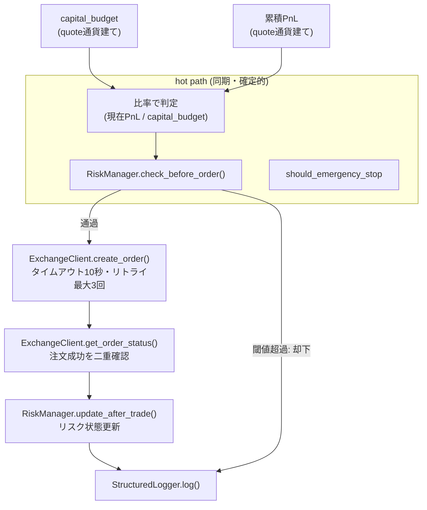

AutoTrader (FastAPI × React Native Expo 製) の自動売買botで、損失上限（daily/weekly loss limit）の持ち方を見直した。制約は「複数の通貨建てbotが同一システム上で混在する」「リスク判定は同期・確定的に保つ」「誤発火で不要な停止を起こさない」の3つ。この記事では、リスク許容度をどの単位で表現するかという設計判断を中心に書く。

## 前提

### 解きたい問題

AutoTraderには `safety/risk_manager.py` という、全botの注文前に必ず通す安全チェッカーがある。`backend/safety/__init__.py` にある通り、安全レイヤーは「負けない設計」を掲げ、RiskManager・PositionReconciler・AnomalyDetector・StructuredLoggerという複数の機構で構成されている。RiskManagerはこの中で「注文前リスクチェック・連敗停止・ドローダウン制限」を担当する。

このRiskManagerには、日次・週次の損失上限を設定して、超えたら新規注文をスキップする仕組みがある。ここで問題になったのは、損失上限を「単一通貨前提の絶対額」でハードコードしていたことだった。

`backend/CLAUDE.md` に記録されている経緯を整理すると、比較対象となるPnLはbotのquote通貨で累積される。BTC/JPYのbotならPnLは円建てで積み上がるし、USDT建てのbotならUSDT建てで積み上がる。USDT前提で決めた絶対値（500や2000といった数値）をJPY建てbotにそのまま適用すると、通貨単位が異なるために約150倍厳しい閾値になってしまう。これが原因で、¥950という実損に対して緊急停止が誤発火した経緯が2026-07-08付けで記録されている。

この事象を受けて `#47` で緊急対策、`#48` で恒久対策という2段階の修正が入っている。この記事で扱うのは、恒久対策側の「損失上限をどういう単位で持つべきか」という設計判断だ。

### 環境

- FastAPI（バックエンド）
- ccxt（複数取引所・複数quote通貨のbotを収容）
- `safety/risk_manager.py`（注文前チェックの中核）
- `engine.py`（`RiskManager.check_before_order()` → 発注 → `RiskManager.update_after_trade()` という一連のフロー）
- 個人運用、複数botが並行稼働

## 設計案の比較

比較したのは「損失上限をどの単位で表現するか」という1点。評価軸は「通貨をまたぐbotへの対応」「実装の単純さ」「hot pathへの影響」の3つ。

### 案A: 通貨ごとに絶対額のテーブルを持つ

JPY建てなら◯円、USDT建てなら◯USDTのように、通貨ごとに個別の絶対額をハードコードまたは設定値として持つ。

**メリット**: 実装は単純。既存の「絶対額で比較する」ロジックをほぼそのまま流用でき、通貨ごとの分岐だけ追加すればよい。

**デメリット**: 通貨が増えるたびに新しい絶対額を決める必要があり、どの数値が「妥当な厳しさ」なのかを毎回人間が判断しないといけない。誤って別通貨の値を流用すると、今回のような誤発火が再発する構造そのものは変わらない。

### 案B: 損失発生時に為替レートを取得して基準通貨に換算する

PnLをその都度、円やドルなど共通の基準通貨に為替換算してから、単一の絶対額と比較する。

**メリット**: 通貨をまたいでも「見た目の厳しさ」を統一できる。1つの絶対額だけ管理すればよくなる。

**デメリット**: `backend/CLAUDE.md` に明記されている通り、リスク判定の hot path (`check_before_order` / `should_emergency_stop`) に為替換算のようなネットワーク越しの取得処理を入れるべきではない。為替APIの遅延や障害が、そのままリスク判定の遅延・失敗に直結してしまう。リスク判定は同期・確定的であるべきで、外部APIの可用性に判定ロジックを引きずられる設計は避けたい。

### 案C: quote通貨建てで解釈するか、`capital_budget` に対する比率で持つ（採用）

損失上限を絶対額ではなく、botの予算 (`capital_budget`) に対する割合として持つ。予算もPnLも同じquote通貨で積み上がっているため、比率にすれば通貨単位そのものが消える。

**メリット**: 予算とPnLが同じquote建てなので、比率は無次元になり通貨をまたいでも意味が変わらない。為替換算のような同期取得を必要とせず、hot pathを同期・確定的なまま保てる。

**デメリット**: 既存の「絶対額で持っていた閾値」を比率に変換する作業が発生する。運用者が閾値の意味を「◯円」から「予算の◯%」に読み替える必要があり、感覚的な把握のしなおしが必要になる。

**案Bと案Cを比較して案Cを選んだ理由**: 案Bは一見素直だが、リスク判定という「注文を出す・出さないを一瞬で決めるべき処理」に、為替APIというネットワーク依存の要素を持ち込むことになる。`check_before_order` / `should_emergency_stop` を同期・確定的に保つという既存方針と真っ向から矛盾する。案Cは、通貨をまたぐ必要のある値を「同期取得できる値（quote別デフォルト表・`capital_budget`）で吸収する」という方針に沿っており、実行時の為替fetchに一切依存しない。通貨非依存という目的を、外部依存を増やさずに達成できる点で案Cを選んだ。

## 採用した設計

### 全体アーキテクチャ

`engine.py` に記載されている一連のフロー（`RiskManager.check_before_order()` → `ExchangeClient.create_order()` → `get_order_status()` による二重確認 → `RiskManager.update_after_trade()` → `StructuredLogger.log()`）の中で、リスク判定部分だけを比率ベースに置き換える形になる。PnLも予算も同じquote通貨で積算されている前提を崩さなければ、この判定は為替情報を一切必要としない。

### 通貨をまたぐ値の吸収方法

通貨をまたぐ必要がある箇所（たとえば複数quote通貨のbotをまとめて一覧表示する場合など）は、実行時の為替fetchではなく、quote別のデフォルト表や `capital_budget` のような、あらかじめ同期的に取得できる値で吸収する方針にしている。リスク判定そのものにはこの吸収処理を持ち込まず、判定は常に「同一quote通貨内の比率計算」に閉じている点がポイントになる。

### 数値比較の扱い

`backend/CLAUDE.md` には、数値比較は `Decimal` か明示的な許容誤差で行い、`a == b` の生比較を禁止する規約がある。損失上限の判定も比率計算である以上、この規約がそのまま適用される。比率という無次元の値になっても、比較のたびに誤差の扱いを丁寧にする必要がある点は変わらない。

## 実装上の罠

### 罠1: 絶対額前提のテストが比率前提の変更に追従していないと壊れる

`backend/tests/test_fee_loss_guard.py` のコメントには、`fee_loss_guard` は `risk_mgr.check_before_order` より下流に位置し、SELL単体に対するゲートなのでリスク制限そのものの影響は受けない、と明記されている。逆に言えば、リスク制限（今回の損失上限）に手を入れる際は、この「下流のゲートは影響を受けない」という前提を壊していないかを都度確認する必要がある。CLAUDE.md の規約でも、engineの新規分岐はdrawdown/daily_loss/連敗/緊急停止を素通りさせることが求められており、既存の安全機構を迂回する分岐を新設しないことが前提になっている。

### 罠2: testnet/mainnet切替とフラグ変更を同じPRに混ぜない

`backend/CLAUDE.md` には、testnetからmainnetへの切替フラグをPRの中でflipしない、フラグ変更は単独PRにする、という規約がある。損失上限のような資金に直結する変更をする際、同じPRでtestnet/mainnetの切替まで行うと、どちらの変更が原因で挙動が変わったのかを切り分けにくくなる。リスク周りの変更は特に、1つのPRで扱う変更範囲を絞る意識が要る。

### 罠3: pre-sell予約のような周辺機能との整合性確認

`backend/CHANGELOG.md` には、`tests/test_pre_sell_reservation.py` にpayloadのorphan候補+reconcile導線を担保する回帰テストを追加し、既存のclamp量アサートで発注挙動の不変を担保した、という記録がある。リスク上限の単位を変更するような横断的な修正では、直接関係なさそうに見える周辺機能（この場合はpre-sell予約の発注量clamp）についても、既存の挙動が変わっていないことを確認するテストを合わせて見ておく必要がある。

## 振り返り

損失上限を絶対額から比率に切り替える判断は、「通貨をまたぐ問題をどこで吸収するか」という一点に集約される。為替換算というネットワーク依存の処理をhot pathに持ち込まず、予算とPnLという既に同じquote通貨で積み上がっている値の比率に落とし込むことで、通貨非依存という目的をシンプルに達成できた。

一方で、この修正が2026-07-08という記録が残るまで表面化しなかった点は重く見ている。単一通貨前提のロジックは、単一通貨で運用している間は何の問題も起こさない。複数のquote通貨を持つbotが実際に混在して初めて、絶対額という単位そのものの前提が崩れる。リスク管理のような「負けない設計」を担う機構ほど、前提にしている単位や次元が何かを明示的に意識しておく必要があると感じている。

`check_before_order` / `should_emergency_stop` を同期・確定的に保つという既存方針は、今回の設計判断の拠り所として一貫して機能した。新しい制約に直面したときも、「hot pathに何を入れないか」という既存の線引きに立ち返ることで、為替換算を持ち込む案を早い段階で外せたのは収穫だった。

---

## 関連リンク

[AutoTrader 実装学習キット (FastAPI × React Native)](https://autotrader.ponfreelance.com/sales/?utm_source=zenn&utm_medium=article&utm_campaign=%E3%83%9D%E3%82%B8%E3%82%B7%E3%83%A7%E3%83%B3%E3%82%B5%E3%82%A4%E3%82%B8%E3%83%B3%E3%82%B0%E3%81%A8%E3%83%AA%E3%82%B9%E3%82%AF%E8%A8%B1%E5%AE%B9%E5%BA%A6)

by ぽん ([@pon_freelance](https://x.com/pon_freelance))

**開発の裏側を購読できます** — AutoTrader のリリースごとに「何を・なぜ・どう変えたか」を 2,000〜4,000 字で書き残しています。バグの原因、取引所 API 変更への追従、設計判断のトレードオフまで。
→ [AutoTrader開発ログ（月500円・いつでも解約可）](https://note.com/clab_jp/membership)
