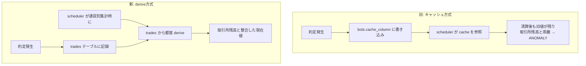

AutoTrader (FastAPI × React Native Expo 製) の scheduler で、通貨別の残高集計をどう組むかを見直した。制約は「取引所ごとに板の薄さ・約定タイミングが異なる」「全清算後の状態を正しく即座に反映する」「個人運用でリアルタイム性を担保する仕組みを別途持たない」の3つ。この記事では、残高集計をキャッシュ値ベースから都度導出ベースに切り替えた設計判断を中心に書く。

## 前提

### 解きたい問題

自動売買botは、複数取引所・複数通貨ペアを同時に扱う構成になっている。scheduler は定期的に各botの状態を通貨別に集計し、残高やポジションの整合性を見ている。ここで問題になったのは、集計対象の「現在値」をどこから取ってくるかという点だった。

`backend/alembic/versions/f6a7b8c9d0e1_drop_cache_columns_phase3b.py` に記録されている背景を見ると、本番で ANOMALY が連発した事象があり、原因は「cache に SELL 全清算後も残った旧値を scheduler の通貨別集計が拾い、取引所残高と乖離した」ことだった。つまり、ポジションが実質ゼロになった後も、キャッシュカラムには清算前の古い値が残り続け、それを scheduler がそのまま使ってしまっていた。

薄い流動性の板を相手にする通貨ペアでは、SELL が複数回に分かれて約定したり、想定より小さい数量ずつしか約定しなかったりする場面がある。全清算が完了したタイミングを scheduler 側が正確に把握できていないと、「もう手元に残っていないはずの数量」を集計に混ぜ込んでしまう。この記事で扱うのは、この種のズレを構造的にどう防ぐかという設計判断になる。

### 環境

- FastAPI（バックエンド）
- ccxt（取引所クライアント、`backend/exchanges.py`）
- PostgreSQL（bots / trades テーブル）
- Alembic（スキーマ管理）
- scheduler（定期実行、通貨別集計を担当）
- 個人運用、複数botが並行稼働

## 設計案の比較

比較したのは「通貨別集計の際、現在のポジション・残高をどこから読むか」という1点。評価軸は「更新漏れへの耐性」「実装の単純さ」「薄い流動性下での正確性」の3つ。

### 案A: bots テーブルにキャッシュカラムを持ち、約定のたびに書き換える

ポジションサイズや評価損益をあらかじめ計算し、`bots` テーブルのカラムに保持しておく。scheduler はこのカラムをそのまま読む。

**メリット**: scheduler 側の集計クエリは単純になる。都度計算するより読み取りが軽い。

**デメリット**: 「約定のたびに正しく書き換える」ことが前提になるが、この前提が崩れた瞬間に古い値が残り続ける。実際に、SELL で全清算された後もキャッシュ値が更新されずに残ったケースが本番で発生している。薄い流動性の板では約定が分割されたり、想定外のタイミングで約定確定が来たりするため、書き換え漏れの経路が単一通貨・単発約定の想定より増える。

### 案B: 都度、trades テーブルから導出して計算する (derive方式・採用)

ポジションや残高を、キャッシュカラムに頼らず `trades` テーブルの約定履歴から都度計算して求める。

**メリット**: 「どこかで書き換えを一箇所忘れる」という種類のバグが構造的に起きない。trades テーブル自体が正であり、そこから毎回導出するので、キャッシュと実体が乖離する余地がない。

**デメリット**: 都度計算のコストがかかる。約定履歴が積み上がるほど、集計クエリの負荷は増える方向になる。

**案Aと案Bを比較して案Bを選んだ理由**: 案Aの問題は、書き換えのタイミングを網羅的に正しく実装し続けることに集計の正確性が依存してしまう点にある。薄い流動性を扱う以上、約定パターンは今後も増える可能性があり、そのたびに「このケースでもキャッシュを更新したか」を人間が確認し続けるのは運用として無理がある。実際に本番で ANOMALY が連発した原因も、まさにこの「更新されなかったキャッシュ」だった。都度導出であれば、更新漏れという概念自体が存在しない。集計コストの増加という代償はあるが、資金に関わる集計が構造的に間違いにくいことを優先し、案Bを採用した。

## 採用した設計

### 全体アーキテクチャ



`trades` テーブルに残っている約定履歴（`symbol` / `trade_type` / `price` / `amount` / `total` / `fee` などの列）から、scheduler が通貨別集計を行うたびに現在のポジション・残高を計算し直す構成にした。`bots` テーブル側にはこの目的のキャッシュカラムを持たせない。

### キャッシュカラムの物理削除

derive 経路に処理を統一しても、キャッシュカラムが物理的にテーブルに残っていれば、どこか別の経路から参照されてしまう可能性が残る。この点は、単に「参照しないようにコードを直す」だけでは再発防止として不十分だと判断した。

```python
# backend/alembic/versions/f6a7b8c9d0e1_drop_cache_columns_phase3b.py:16
# 背景:
#   2026-05-04 の本番 ANOMALY 連発 (BTC bot 76ff21f7) が、cache に SELL 全清算後も
#   残った旧値 0.00160778 を scheduler の通貨別集計が拾い、取引所残高と乖離した
#   ことに起因。derive 経路に統一しても物理カラムが残れば参照される可能性がある
#   ため、構造的に再発しないよう物理削除する。
```

コード上の参照を消すだけでなく、カラムそのものを DROP するマイグレーションを実行することで、「誰かが後から便利だと思って古いカラムを再度読み込んでしまう」経路自体を潰している。これは「なぜそこまでやるのか」という判断だが、キャッシュが一度でも本番障害の原因になった以上、再発の可能性を残す構造そのものを排除する方が、コードレビューの注意力に頼るより確実だと考えた。

## 実装上の罠

### 罠1: 取引所固有のクセを engine 側に書いてしまう

薄い流動性の板を扱う取引所では、最小ロットサイズやレート制限、手数料体系が取引所ごとに異なる。こうしたクセを都度導出のロジックに混ぜ込むと、derive のコード自体が取引所依存になり、見通しが悪くなる。`backend/CLAUDE.md` には、取引所固有のハック（最小ロット・シンボル変換・レート制限・手数料）は必ず `EXCHANGE_QUIRKS` に追記し、engine 側に直書きしないという規約がある。derive 方式に統一する際も、この切り分けを崩さないようにする必要がある。

### 罠2: ccxt の例外を握り潰さない

薄い流動性の板では、注文が期待通りに約定しない、部分約定になる、といった例外的な応答が通常より起きやすい。`backend/CLAUDE.md` では、ccxt の例外を `except Exception: pass` で握り潰さず、最低でもログに残した上で上位に伝播させることを求めている。derive 方式は trades テーブルを唯一の正としているため、そもそも trades への記録自体が欠けていると、derive の結果も正しくならない。例外を握り潰して記録が欠けることが、derive 方式にとっては案A以上に致命的になり得る点は意識しておく必要がある。

### 罠3: strategy_config によって板への向き合い方が変わる

`backend/backtest/engine.py` に見られるように、戦略には rule / grid / ai / arb といった種類があり、それぞれ通貨ペア・取引所・時間足・戦略パラメータの組み合わせで動く。薄い流動性の板を前提にした戦略（グリッドや裁定など）ほど、約定が細かく分割されやすく、trades テーブルに記録される行数も増える傾向がある。derive 方式のクエリ負荷は、こうした戦略の組み合わせによって差が出ることを踏まえておく必要がある。

## 振り返り

キャッシュ値を都度更新する方式は、実装した瞬間は素直で分かりやすいが、「更新を一箇所でも忘れたら壊れる」という前提の上に成り立っている。薄い流動性の板を相手にする自動売買では、約定のタイミングやパターンが単純な想定より多様になりやすく、この前提はどこかで崩れる。実際に本番で ANOMALY が連発した経緯を踏まえると、キャッシュという仕組み自体が持つ「更新漏れ」という壊れ方を構造的に排除する方が、個人運用の限られた監視体制に見合っていると感じている。

都度導出は計算コストという代償を伴うが、資金に関わる集計において「どこかの更新を忘れていないか」を人間が確認し続ける必要がなくなる点は大きい。加えて、コードから参照を消すだけでなく、原因になったカラムそのものを物理的に削除したことも、再発防止という観点では意味のある判断だったと考えている。仕組みとして間違えようがない状態にしておくことが、監視の手が薄い個人運用では特に効いてくる。

---

## 関連リンク

[AutoTrader 実装学習キット (FastAPI × React Native)](https://autotrader.ponfreelance.com/sales/?utm_source=zenn&utm_medium=article&utm_campaign=%E8%96%84%E3%81%84%E6%B5%81%E5%8B%95%E6%80%A7-%E6%9D%BF%E6%83%85%E5%A0%B1%E3%81%AE%E6%89%B1%E3%81%84)

by ぽん ([@pon_freelance](https://x.com/pon_freelance))

**開発の裏側を購読できます** — AutoTrader のリリースごとに「何を・なぜ・どう変えたか」を 2,000〜4,000 字で書き残しています。バグの原因、取引所 API 変更への追従、設計判断のトレードオフまで。
→ [AutoTrader開発ログ（月500円・いつでも解約可）](https://note.com/clab_jp/membership)
